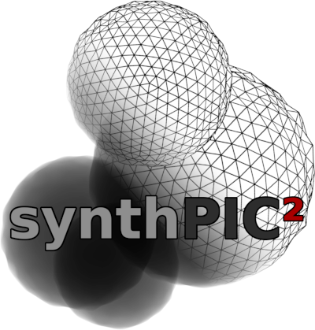

|

.. image:: https://img.shields.io/github/license/IntelligentPMT/synthPIC2.svg
   :alt: License: GPLv3
   :target: https://github.com/IntelligentPMT/synthPIC2/blob/main/LICENSE

.. image:: https://img.shields.io/badge/dockerhub-maxfrei750/synthpic2-blue
   :alt: Platform: docker
   :target: https://hub.docker.com/r/maxfrei750/synthpic2

.. image:: https://img.shields.io/badge/blender-v3.3.2 LTS-e87d0d
   :alt: Blender: v3.3.2 LTS
   :target: https://www.blender.org/download/lts/3-3/#versions

|

.. raw:: html

   

         
         
         
   

   

         
         
         
   

Setup / Installation
--------------------

* Install `Docker <https://docs.docker.com/get-docker/>`_.

  **NOTE:** On Windows, GPU support in Docker requires Windows 10 Version 21H2 or higher and `WSL 2 <https://learn.microsoft.com/de-de/windows/wsl/install>`_.

* Download a `release <https://github.com/maxfrei750/synthPIC2/releases>`_ of synthPIC2 and extract it.
* Copy `.env.example`, rename it to `.env` and adjust the required values.
* Open a command line in the extracted folder.
* Pull the docker image: ::

    docker compose pull

**NOTE:** VS Code users need to have ``python>=3.5`` installed on their systems, for VS Code to interact correctly with the development container.

First Steps
-----------

**NOTE:** On machines *without a GPU*, the `docker-compose.yaml` file needs to be modified by removing the section: ::

  deploy:
    resources:
      reservations:
        devices:
          - capabilities: [ gpu ]

* Start the docker container: ::

    docker compose run app

* Inside the container, execute the demo: ::

    python run.py --config-dir=recipes --config-name=beads --multirun initial_runtime_state.seed="range(3)"

* Wait for the renders to finish.

* Inspect the rendered images in the `output/beads` folder.

Minimal Example
---------------

In this little example, we create our very first recipe file for image synthetization. Therefore, let's create a new file and name it ``hello_world.yaml``. We place this file inside the ``recipes`` subfolder under our root folder of ``synthPIC2`` and add our first three lines in the file.

.. code-block:: yaml

    defaults:
      - s_PrepareWorld
      - _self_

In these three lines, we define two defaults, which will be merged into one single recipe in the given sequential order. The first prepares the scene for generating a synthesized image, which shows some text. The second default ``_self_`` will merge the content of this file. So as a next step, let's now add some content: We add 5 more lines to our ``hello_world.yaml`` file.

.. code-block:: yaml

    process_conditions:
      feature_variabilities:
        WriteText:
          variability:
            value: Hello World

In these lines, we just specified, that there is a feature, which is variable. This feature is called ``WriteText``. As the variable part, we assign the string ``'Hello World'`` to it. In order to execute this recipe, we need to call the function ``run.py`` with the parameter ``--config-name=hello_world``. The latter specifies the name of the recipe file, while the file extension ``yaml`` is excluded.

.. code-block:: bash

    python run.py --config-dir=recipes --config-name=hello_world

We synthesized our first image, which can be found in the file ``output/hello_world/<YYYY-MM-DD_hh-mm-ss>/run0/real/<hash>.png`` under our root directory of ``synthPIC2``.

Compile Documentation
---------------------

* Start the docker container: ::

    docker-compose run app

* Start ``sphinx-autobuild``, which will build the documentation, watch for changes and rebuild if necessary: ::

    sphinx-autobuild docs/source docs/build/html --host 0.0.0.0

* Visit http://localhost:8000/, to see the documentation.

* Refer to the `sphinx tutorial <https://www.sphinx-doc.org/en/master/tutorial/index.html>`_ for more help.
