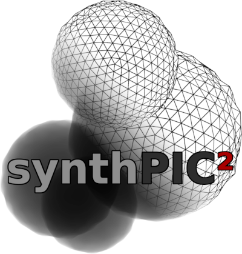

.. synthPIC2 documentation master file, created by
   sphinx-quickstart on Wed Oct  5 10:00:38 2022.
   You can adapt this file completely to your liking, but it should at least
   contain the root `toctree` directive.

|

.. image:: _static/logo_ude.svg
   :height: 80
   :alt: University Duisburg-Essen Logo
   :target: https://www.uni-due.de/nst/index_en.php

Toolbox for the generation of image-based particle measurement training and validation
data.

Contents
========

.. toctree::
   :maxdepth: 2

   getting_started
   tutorials
   concepts
   dev_guides
   references

Indices and tables
==================

* :ref:`genindex`
* :ref:`modindex`
* :ref:`search`
