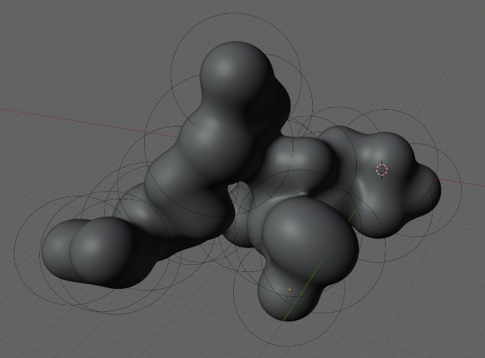
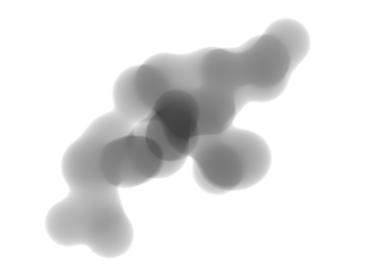
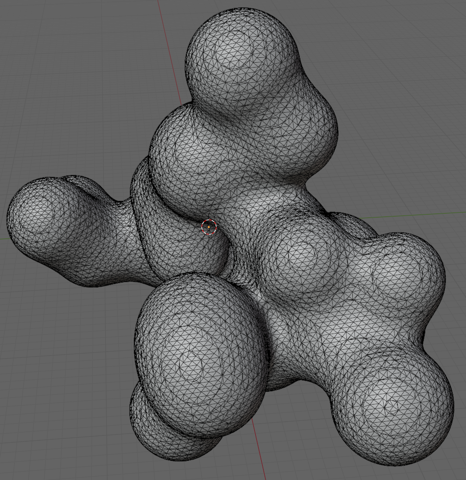
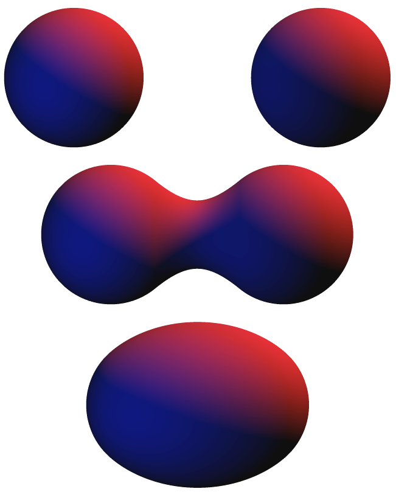
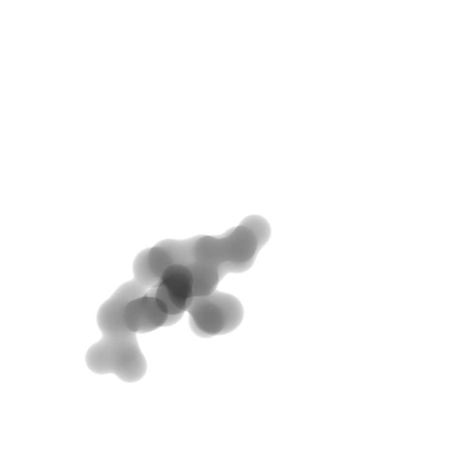

TEM: Agglomeration, Metaballs & STL export
==========================================

In this tutorial we will see how we can create an agglomerate from a set of particles, render it in the style of a transmission electron microscopy (TEM) image and export the resulting geometry as an STL file.

Since this is an advanced tutorial, it assumes that you are already familiar with the basics of the toolbox. Also, we assume that you are familiar with the basics of agglomeration. A good summary can be found in Friedlander (2000) "Smoke, dust, and haze: Fundamentals of aerosol dynamics", Chapter 8.

At a Glance
-----------

What You Will Learn
-------------------

* How to create lifelike agglomerates.
* How to use the ``AgglomerateParticles`` feature generation step.
* How to simulate sintering using `metaballs <https://en.wikipedia.org/wiki/Metaballs>`_.
* How to render images that resemble transmission electron microscopy (TEM) images.
* How to export sets of particles as STL files.

Recipe
------

The recipe for this tutorial can be found in `recipes/agglom_tem.yaml`:

.. code-block:: yaml
  :caption: recipes/agglom_tem.yaml

  defaults:
    - BaseRecipe
    - _self_

  initial_runtime_state:
    time: 0.0
    seed: 42
  blueprints:
    measurement_techniques:
      SecondaryElectronMicroscope:
        measurement_technique_prototype_name: transmission_electron_microscope
    particles:
      Bead:
        geometry_prototype_name: meta_ball_sphere
        material_prototype_name: tem_amorphous
        parent: MeasurementVolume
        number: 25
  process_conditions:
    feature_variabilities:
      ParticleDimension:
        feature_name: dimensions
        variability:
          _target_: $builtins.UniformDistribution3dHomogeneous
          location: 6
          scale: 3
      ParticleDensity:
        feature_name: density
        variability:
          _target_: $builtins.Constant
          value: 0.1
  synth_chain:
    feature_generation_steps:
      - _target_: $builtins.InvokeBlueprints
        affected_set_name: AllMeasurementTechniqueBlueprints
      - _target_: $builtins.InvokeBlueprints
        affected_set_name: AllParticleBlueprints
      - _target_: $builtins.TriggerFeatureUpdate
        feature_variability_name: ParticleDimension
        affected_set_name: AllParticles
      - _target_: $builtins.TriggerFeatureUpdate
        feature_variability_name: ParticleDensity
        affected_set_name: AllParticles
      - _target_: $builtins.AgglomerateParticles
        affected_set_name: AllParticles
        speed: 10
        randomness: 0
        mode: cluster-cluster
        sintering_ratio: 0.1
    rendering_steps:
      - _target_: $builtins.SaveState
        name: state
      - _target_: $builtins.RenderParticlesTogether
        rendering_mode: real
        do_save_features: True
      - _target_: $builtins.RenderParticlesTogether
        rendering_mode: stl

Step 1: Simulating Transmission Electron Microscopy (TEM)
---------------------------------------------------------

To simulate TEM, we not only have to specify the ``transmission_electron_microscope`` measurement technique prototype, but also have to combine it with the ``tem_amorphous`` material prototype. Note that this material prototype is only suitable for the simulation of `amorphous` materials, i.e. it does not account for anisotropy and diffraction as you would encounter in crystalline materials.

.. code-block:: yaml
  :emphasize-lines: 5, 9

  ...
  blueprints:
    measurement_techniques:
      SecondaryElectronMicroscope:
        measurement_technique_prototype_name: transmission_electron_microscope
    particles:
      Bead:
        geometry_prototype_name: meta_ball_sphere
        material_prototype_name: tem_amorphous
        parent: MeasurementVolume
        number: 25
  ...

To change the absorption of the ``tem_amorphous`` material, we can use its density feature:

.. code-block:: yaml
  :emphasize-lines: 5-9, 13-15

  ...
  process_conditions:
    feature_variabilities:
      ...
      ParticleDensity:
        feature_name: density
        variability:
          _target_: $builtins.Constant
          value: 0.1
  synth_chain:
    feature_generation_steps:
      ...
      - _target_: $builtins.TriggerFeatureUpdate
        feature_variability_name: ParticleDensity
        affected_set_name: AllParticles

Step 2: Simulate Agglomeration And Sintering
--------------------------------------------

To prepare for the agglomeration, we first create a number of primary particles using the ``InvokeBlueprints`` feature generation step with the ``AllParticleBlueprints`` set and scale them using the previously defined ``ParticleDimension`` feature variability.

.. code-block:: yaml
  :emphasize-lines: 6-10

  ...
  synth_chain:
    feature_generation_steps:
      - _target_: $builtins.InvokeBlueprints
        affected_set_name: AllMeasurementTechniqueBlueprints
      - _target_: $builtins.InvokeBlueprints
        affected_set_name: AllParticleBlueprints
      - _target_: $builtins.TriggerFeatureUpdate
        feature_variability_name: ParticleDimension
        affected_set_name: AllParticles
  ...

Ultimately, we trigger the agglomeration with the ``AgglomerateParticles`` feature generation step:

.. code-block:: yaml
  :emphasize-lines: 5-10

  ...
  synth_chain:
    feature_generation_steps:
      ...
      - _target_: $builtins.AgglomerateParticles
        affected_set_name: AllParticles
        speed: 10
        randomness: 0
        mode: cluster-cluster
        sintering_ratio: 0.1
  ...

The ``AgglomerateParticles`` feature generation step operates on a set of particles, defined by the  ``affected_set_name``. From this set, collision partners are selected and collided by simulating their movement through a simulation space with periodic boundaries. While the ``speed`` parameter controls the step size of the simulation and thereby its speed and accuracy (a lower speed results in a more precise collision detection), the ``randomness`` controls how random the walk of the collision partners through the simulation space is. ``randomness: 0`` results in ballistic transport, whereas ``randomness: 1`` results in diffusion-limited transport.

The selection of collision partners is controlled by the ``mode`` parameter. For ``mode: particle-cluster``, one primary particle at a time is added to a central cluster in a random order. In contrast, for ``mode: cluster-cluster``, multiple clusters are grown in parallel, with the collision order being controlled by the inter-cluster collision probability, which depends on the relative collision frequency and therefore the cluster size. Common agglomeration modes can be simulated as follows:

* ballistic particle-cluster agglomeration: ``randomness: 0``, ``mode: particle-cluster``
* diffusion-limited particle-cluster agglomeration: ``randomness: 1``, ``mode: particle-cluster``
* ballistic cluster-cluster agglomeration: ``randomness: 0``, ``mode: cluster-cluster``
* diffusion-limited cluster-cluster agglomeration: ``randomness: 1``, ``mode: cluster-cluster``

Sintering can be simulated using the ``sintering_ratio`` parameter of the ``AgglomerateParticles`` feature generation step. It controls how much two colliding primary particles overlap after a collision, with ``sintering_ratio: 0`` resulting in a point contact and ``sintering_ratio: 1`` resulting in an alignment of the centers of gravity of the two colliding primary particles.

To simulate the characteristic sintering `necks` between the primary particles, we use the ``meta_ball_sphere`` geometry prototype:

.. code-block:: yaml
  :emphasize-lines: 8

  ...
  blueprints:
    measurement_techniques:
      SecondaryElectronMicroscope:
        measurement_technique_prototype_name: transmission_electron_microscope
    particles:
      Bead:
        geometry_prototype_name: meta_ball_sphere
        material_prototype_name: tem_amorphous
        parent: MeasurementVolume
        number: 25
  ...

This prototype is very special, since unlike other geometry prototypes, it does not hold a mesh but a `metaball object`. To learn more about metaballs, you can watch the following video:

.. raw:: html

  <iframe width="560" height="315" src="https://www.youtube.com/embed/rumYWmWTkQQ" title="YouTube video player" frameborder="0" allow="accelerometer; autoplay; clipboard-write; encrypted-media; gyroscope; picture-in-picture" allowfullscreen></iframe>

For now, it suffices to know that metaballs have a primitive shape (e.g. spherical, ellipsoid or cubic) and merge when they are close to each other:

  Examples of metaballs (source: `Wikipedia <https://en.wikipedia.org/wiki/Metaballs>`_).

For the recipe at hand, the parameters yield the following geometry:

Step 3: Rendering (STL Export)
------------------------------

Most recipes end with rendering steps that produce an image and some form of ground truth:

.. code-block:: yaml
  :emphasize-lines: 8-12

  ...
  synth_chain:
    feature_generation_steps:
      ...
    rendering_steps:
      - _target_: $builtins.SaveState
        name: state
      - _target_: $builtins.RenderParticlesTogether
        rendering_mode: real
        do_save_features: True
      - _target_: $builtins.RenderParticlesTogether
        rendering_mode: stl

We already know ``rendering_mode: real``, which produces a lifelike image of our agglomerate:

  Resulting "real" image.

Unlike other recipes, this recipe does not produce a 2D representation of the ground truth, but saves a 3D model in form of an STL file, using ``rendering_mode: stl``:

  The resulting STL file, when being re-imported to Blender. Note that it no longer consists of metaballs, but has been converted into a triangulated mesh.

Just as other rendering modes, the STL rendering mode can be used with both ``RenderParticlesTogether`` and ``RenderParticlesIndividually``.
