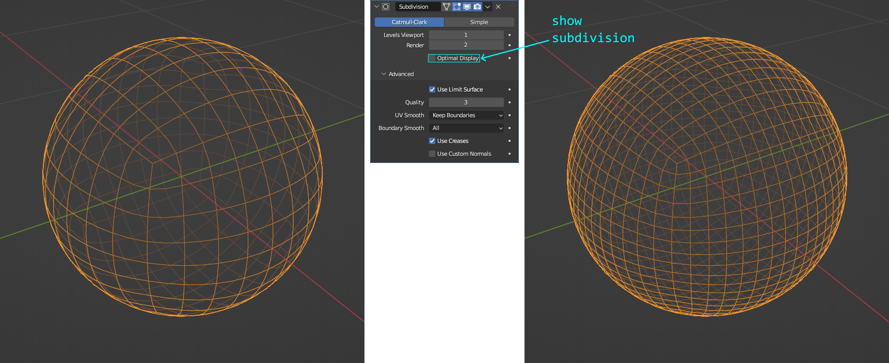
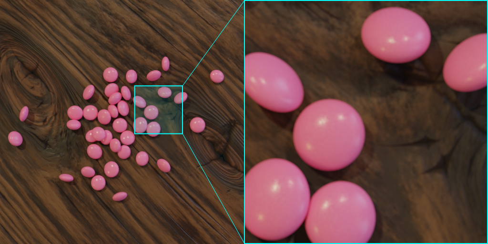
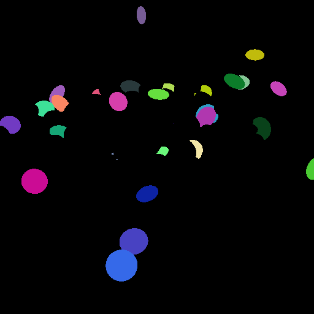

.. _sec-tut_at_chocBeans_table:

Chocolate Beans on Table
========================

In this tutorial, we'll extend our workflow by including the generation of a prototype. Based on the previous `basic` tutorials, our starting scene will be similar: We generate pink pearls on a plane and step-by-step increase the complexity of the scene. A more in-depth use of our beloved ``RelaxCollisions`` function will introduce the ``dry_run`` mode.

At a Glance
-----------

.. image:: ../_static/tuts/chocBeans_table/AAG_3.png
    :width: 24.5 %

What We Will Learn
------------------

* Create a new, own prototype
* Illuminate the scene by HDRI light
* Create different particle classes
* Color definition in HSV representation
* Specify particles based on dynamic sets

Step 1: Prepare a Clean Start
-----------------------------

Let's put aside those plasticines and deformed particles. We want to start this time, by a clean and simple scene with pink pearls: Create a new recipe and call it ``chocBeans_table.yaml``. Our first code snippet, as usual, will initialize and seed the recipe.

.. code-block:: yaml
    :caption: chocBeans_table.yaml

    # Initializing and seeding
    defaults:
      - BaseRecipe
      - _self_
    initial_runtime_state:
      seed: 42

We want to start with a similar scene like last time, choosing the ``cracks_subtle`` material for our background and the ``colored_subtle`` material for our particles. However, the measurement technique used in this tutorial will be another one, called ``woodTable_sideCam``.

.. code-block:: yaml
    :caption: chocBeans_table.yaml

    # Defining blueprints
    blueprints:
      measurement_techniques:
        TopCamInAir:
          measurement_technique_prototype_name: woodTable_sideCam
          background_material_prototype_name: cracks_subtle
      particles:
        Bead:
          geometry_prototype_name: sphere
          material_prototype_name: colored_subtle
          number: 40

As the name of the measurement technique suggests, we need to slightly adjust the camera angle. Doing so, let's directly add our other ``process_conditions``, as well.

.. code-block:: yaml
    :caption: chocBeans_table.yaml

    # Physical boundary conditions
    process_conditions:
      feature_variabilities:
        CameraAltitude:
          feature_name: cam_altitude
          variability:
            _target_: $builtins.Constant
            value: 0.96
        InitialParticleLocation:
          feature_name: location
          variability:
            _target_: $builtins.UniformlyRandomLocationInMeasurementVolume
        ParticleDimension:
          feature_name: dimensions
          variability:
            _target_: $builtins.UniformDistribution3dHomogeneous
            location: 3.58
            scale: 0.6
        RenderingResolutionPercentage:
          feature_name: resolution_percentage
          variability:
            _target_: $builtins.Constant
            value: 25
        CyclesSamples:
          feature_name: cycles_samples
          variability:
            _target_: $builtins.Constant
            value: 64

Now we can build our synth chain by starting with the invocation of our blueprints. Afterwards, we trigger of the updates for our features ``cam_altitude``, ``location`` and ``dimensions``, which are allowed in the ranges ``CameraAltitude``, ``InitialParticleLocation`` and ``ParticleDimension``, respectively.

.. code-block:: yaml
    :caption: chocBeans_table.yaml

    # Procedural steps of synthetization chain
    synth_chain:
      feature_generation_steps:
        - _target_: $builtins.InvokeBlueprints
          affected_set_name: AllMeasurementTechniqueBlueprints
        - _target_: $builtins.InvokeBlueprints
          affected_set_name: AllParticleBlueprints
        - _target_: $builtins.TriggerFeatureUpdate
          feature_variability_name: CameraAltitude
          affected_set_name: AllMeasurementTechniques
        - _target_: $builtins.TriggerFeatureUpdate
          feature_variability_name: InitialParticleLocation
          affected_set_name: AllParticles
        - _target_: $builtins.TriggerFeatureUpdate
          feature_variability_name: ParticleDimension
          affected_set_name: AllParticles

Since again, we want to distribute particles laying flat on a plane, we use the ``RelaxCollisions`` function two times, as we did in our previous tutorials. First, to get rid of intersections. A second call -- with gravity enabled -- to bring all particles onto the ground level.

.. code-block:: yaml
    :caption: chocBeans_table.yaml
    :emphasize-lines: 8-21

    synth_chain:
      feature_generation_steps:
        - _target_: $builtins.InvokeBlueprints …
        - _target_: $builtins.InvokeBlueprints …
        - _target_: $builtins.TriggerFeatureUpdate …
        - _target_: $builtins.TriggerFeatureUpdate …
        - _target_: $builtins.TriggerFeatureUpdate …
        - _target_: $builtins.RelaxCollisions
          affected_set_name: AllParticles
          num_frames: 5
          time_scale: 10
          collision_shape: CONVEX_HULL
        - _target_: $builtins.RelaxCollisions
          affected_set_name: AllParticles
          use_gravity: True
          damping: 0.1
          friction: 0.999
          restitution: 0.001
          collision_margin: 0.001
          num_frames: 200
          collision_shape: CONVEX_HULL

The last ingredients, we add to our recipe are two more elements in the list of ``feature_generation_steps`` and one step for the list of ``rendering_steps``.

.. code-block:: yaml
    :caption: chocBeans_table.yaml
    :emphasize-lines: 10-19

    synth_chain:
      feature_generation_steps:
        - _target_: $builtins.InvokeBlueprints …
        - _target_: $builtins.InvokeBlueprints …
        - _target_: $builtins.TriggerFeatureUpdate …
        - _target_: $builtins.TriggerFeatureUpdate …
        - _target_: $builtins.TriggerFeatureUpdate …
        - _target_: $builtins.RelaxCollisions …
        - _target_: $builtins.RelaxCollisions …
        - _target_: $builtins.TriggerFeatureUpdate
          feature_variability_name: RenderingResolutionPercentage
          affected_set_name: AllMeasurementTechniques
        - _target_: $builtins.TriggerFeatureUpdate
          feature_variability_name: CyclesSamples
          affected_set_name: AllMeasurementTechniques
      rendering_steps:
        - _target_: $builtins.RenderParticlesTogether
          rendering_mode: real
          do_save_features: True

Now we have our whole recipe together for a clean, basic start. Let's execute it!

.. code-block:: python

    python run.py --config-dir=recipes --config-name=chocBeans_table

Since, you very attentively followed the tutorial, instead of just copy-pasting the code snippets, you rightly ask yourself: "Why is there color?" The answer is: It sits in the both material prototypes and we're looking at their default colors. It just coincidentally happens to be the color of our previous tutorials: pink for the particles, beige for the background. Pretty!

Some more little changes we notice. There is no gap between the particles -- see parameter ``collision_margin: 0.001`` of our second ``RelaxCollisions`` function -- and one particle at the bottom is almost out of our field of view. The latter is caused by another bounding box than that used in earlier tutorials, i.e. the ``MeasurementVolume``, which limits our particles' spatial distribution for this loaded measurement technique prototype. Furthermore, we notice the two shadows of each particle and will come to the explanation later.

As a last measure, let's add the ``material prototype`` for our ``measurement volume`` and the ``parent`` of our particle blueprint ``Bead``. This doesn't change the appearance of the scene, but is just good practice for completion of our recipe at this stage.

.. code-block:: yaml
    :caption: chocBeans_table.yaml
    :emphasize-lines: 5,11

    blueprints:
      measurement_techniques:
        TopCamInAir:
          measurement_technique_prototype_name: woodTable_sideCam
          measurement_volume_material_prototype_name: vacuum
          background_material_prototype_name: cracks_subtle
      particles:
        Bead:
          geometry_prototype_name: sphere
          material_prototype_name: colored_subtle
          parent: MeasurementVolume
          number: 40

Step 2: Our Own Offspring
-------------------------

In this step, we will actually create a new ``geometry prototype`` for our particle blueprint ``Bead``, integrate it in our recipe and manipulate some features of it. Keep in mind that this is not a ``Blender`` tutorial, so we'll barely scratch the surface of that wonderful tool. Rather, we introduce the general idea of integrating a new ``geometry prototype`` to our toolbox ``synthPIC2``.

Let's first start by opening ``Blender`` with a new default ``General`` scene. We delete the default cube and add a ``Mesh`` > ``Round Cube``. As ``Radius`` we specify ``0.5`` and a ``Size`` of ``1.0`` in all three spatial dimensions ``X``, ``Y`` and ``Z``. In general, we want our prototypes to have a basic spatial extent of ``1.0`` in all directions to achieve size consistency across multiple ``geometry prototypes``. For ``Divisions``, we define a number of ``8`` for ``Arc`` as sufficient.

.. image:: ../_static/tuts/chocBeans_table/cube_sphere.png
    :alt: Deleted default cube and created sphere

Next, we want to change the faces' appearance of our geometry. Therefore, we set ``Shade Smooth`` (right click on object), which renders and displays faces smooth, using interpolated vertex normals. Furthermore, let's add a `Subdivision Surface` modifier and keep all the settings as their default values. This will set the `Catmull-Clark` algorithm with ``1`` subdivision level for the viewport and a level of ``2`` for the final render. The `Subdivision Surface` modifier gives us a great opportunity to later on -- during the execution of our ``SynthRecipe`` in ``synthPIC2`` -- change the resolution of our particle geometry.

We want to create a prototype that represents an ellipsoid. So, let's scale it along the ``Z`` axis by a factor of ``0.5``. Basically, this should just obviously show that this prototype represents an ellipsoid -- we'll anyways make this parameter available as a feature to enable a manipulation directly in ``synthPIC2``. As per definition for a ``geometry prototype``, we also need to rename the object of interest in our scene, which is still called ``Roundcube``. The concrete name must be ``GeometryPrototype`` for ``synthPIC2`` to identify it.

Now let's introduce the flexibility: We will give ``synthPIC2`` access to change `any` feature, for which we want to allow a manipulation. To do so, you must first setup ``Blender`` to display the ``blender_link``, which we need in ``synthPIC2``. Therefore, in ``Blender`` go to ``Edit`` > ``Preferences...`` > ``Interface`` > ``Tooltips`` and enable the option ``Python Tooltips``. Now, when you hover over (almost) any menu entry in the GUI of ``Blender``, you will see the address of that concrete parameter in ``Python`` with its namespace. It reads something like, e.g. ``bpy.data.objects…`` and equals the entry, which we need for our accompanying ``yaml`` file of each ``prototype``. You can easily copy this concrete link of a specific ``feature`` within ``Blender`` by right-clicking on it and then select ``Copy Full Data Path``.

The name of a ``feature`` for ``synthPIC2``, which represents the ``blender_link``, can be freely chosen. But keep in mind! ``Features`` can be manipulated completely flexible across all invoked blueprints, independent if the feature, e.g. ``color`` origins from the ``material prototype`` of a particle or the ``measurement volume material`` or the ``background material`` of the measurement technique or if it origins from any ``geometry prototype``. Once invoked, every object of the scene possesses those features with the names defined in their corresponding ``prototypes``. Therefore, you should establish some rules for generic feature names and exclusive feature names to make use of this powerful capability of ``synthPIC2`` to change all kinds of ``features`` across all objects in the scene at once -- if wanted and constrainable to specific groups of objects by ``sets``.

Now that we know how to do it: Let's actually take some parameters in ``Blender`` and define those to become our manipulable ``features`` in ``synthPIC2``!

First, we save the modeled ``geometry prototype`` for our ellipsoid. We need to place it in the location ``prototype_library/geometries/`` and give the name ``ellipsoid.blend``. For the accompanying file, we create a new file with name ``ellipsoid.yaml`` and place it in the same directory. Let's add the following lines to that accompanying file to make manipulation of these features available in ``synthPIC2``.

.. code-block:: yaml
    :caption: ellipsoid.yaml

    features:
      - name: dimensions
        blender_link: bpy.data.objects["GeometryPrototype"].dimensions
      - name: width
        blender_link: bpy.data.objects["GeometryPrototype"].scale[1]
      - name: height
        blender_link: bpy.data.objects["GeometryPrototype"].scale[2]
      - name: location
        blender_link: bpy.data.objects["GeometryPrototype"].location
      - name: location_z
        blender_link: bpy.data.objects["GeometryPrototype"].location.z
      - name: subdivisions
        blender_link: bpy.data.objects["GeometryPrototype"].modifiers["Subdivision"].render_levels

Finally, let's bring it into our scene, that new prototype! To do so, within our ``SynthRecipe``, we need to change the ``geometry_prototype_name`` of our ``Bead``.

.. code-block:: yaml
    :caption: chocBeans_table.yaml
    :emphasize-lines: 5

    blueprints:
      measurement_techniques: …
      particles:
        Bead:
          geometry_prototype_name: ellipsoid
          material_prototype_name: colored_subtle
          parent: MeasurementVolume
          number: 40

We also want to see the change of some parameters! So let's play with the height. To see an obvious effect, we try a weird shape with a height that is three times the width of the ellipsoid by adding a new ``feature variability`` called ``ParticleHeight``.

.. code-block:: yaml
    :caption: chocBeans_table.yaml
    :emphasize-lines: 6-10

    process_conditions:
      feature_variabilities:
        CameraAltitude: …
        InitialParticleLocation: …
        ParticleDimension: …
        ParticleHeight:
          feature_name: height
          variability:
            _target_: $builtins.Constant
            value: 3

Furthermore, we add the corresponding ``feature_generation_step`` to trigger the feature update.

.. code-block:: yaml
    :caption: chocBeans_table.yaml
    :emphasize-lines: 12-14

    synth_chain:
      feature_generation_steps:
        - _target_: $builtins.InvokeBlueprints …
        - _target_: $builtins.InvokeBlueprints …
        - _target_: $builtins.TriggerFeatureUpdate …
        - _target_: $builtins.TriggerFeatureUpdate
          feature_variability_name: InitialParticleLocation
          affected_set_name: AllParticles
        - _target_: $builtins.TriggerFeatureUpdate
          feature_variability_name: ParticleDimension
          affected_set_name: AllParticles
        - _target_: $builtins.TriggerFeatureUpdate
          feature_variability_name: ParticleHeight
          affected_set_name: AllParticles 

An execution of the recipe will give us a -- yes, let's call it a weird -- shape of our ellipsoidal particles, which obviously differs from the sphere.

.. image:: ../_static/tuts/chocBeans_table/suppository.png
    :alt: Obviously elongated shape of ellipsoid

Keep in mind that we already triggered the updates of our features ``location`` and ``dimensions`` within their allowed ranges ``InitialParticleLocation`` and ``ParticleDimension``, respectively for these ellipsoids. We did so by choosing the appropriate ``feature`` names, when we defined the ``features`` in the accompanying file ``ellipsoid.yaml``. So, since we kept to those naming conventions, we didn't need to adjust anything else in the recipe.

Okay, that works. Now let's go more in the direction of a usual shape for a chocolate bean. We create a further ``feature variability`` for the feature ``width`` and also adapt the recent one for the feature ``height``. Both shall be allowed within a certain range instead of only defining a specific constant.

.. code-block:: yaml
    :caption: chocBeans_table.yaml
    :emphasize-lines: 6-12,16-19

    process_conditions:
      feature_variabilities:
        CameraAltitude: …
        InitialParticleLocation: …
        ParticleDimension: …
        ParticleWidth:
          feature_name: width
          variability:
            _target_: $builtins.UniformDistributionNdHomogeneous
            location: 0.85
            scale: 0.15
            num_dimensions: 1
        ParticleHeight:
          feature_name: height
          variability:
            _target_: $builtins.UniformDistributionNdHomogeneous
            location: 0.475
            scale: 0.15
            num_dimensions: 1

We only need to add the ``TriggerFeatureUpdate`` for ``ParticleWidth`` now.

.. code-block:: yaml
    :caption: chocBeans_table.yaml
    :emphasize-lines: 10-12

    synth_chain:
      feature_generation_steps:
        - _target_: $builtins.InvokeBlueprints …
        - _target_: $builtins.InvokeBlueprints …
        - _target_: $builtins.TriggerFeatureUpdate …
        - _target_: $builtins.TriggerFeatureUpdate …
        - _target_: $builtins.TriggerFeatureUpdate
          feature_variability_name: ParticleDimension
          affected_set_name: AllParticles
        - _target_: $builtins.TriggerFeatureUpdate
          feature_variability_name: ParticleWidth
          affected_set_name: AllParticles
        - _target_: $builtins.TriggerFeatureUpdate
          feature_variability_name: ParticleHeight
          affected_set_name: AllParticles 

The currently rendered image looks more like ellipsoids in the shape of chocolate beans.

.. image:: ../_static/tuts/chocBeans_table/ellipsoid_shapeChocBean.png
    :alt: Ellipsoids with shapes of chocolate beans

Step 3: Material, Light and Perspective
---------------------------------------

We're getting closer! Now, let's tune it a little bit and slightly change the behavior of how the particles fall: We'll only turn down the ``damping`` of the `second` ``RelaxCollisions`` function just a little bit.

.. code-block:: yaml
    :caption: chocBeans_table.yaml
    :emphasize-lines: 9

        - _target_: $builtins.RelaxCollisions
          affected_set_name: AllParticles
          num_frames: 5
          time_scale: 10
          collision_shape: CONVEX_HULL
        - _target_: $builtins.RelaxCollisions
          affected_set_name: AllParticles
          use_gravity: True
          damping: 0.07
          friction: 0.999
          restitution: 0.001
          collision_margin: 0.001
          num_frames: 200
          collision_shape: CONVEX_HULL

Furthermore, we change the material of our background to a material named ``wood``.

.. code-block:: yaml
    :caption: chocBeans_table.yaml
    :emphasize-lines: 6

    blueprints:
      measurement_techniques:
        TopCamInAir:
          measurement_technique_prototype_name: woodTable_sideCam
          measurement_volume_material_prototype_name: vacuum
          background_material_prototype_name: wood

The currently rendered image placed our particles more in the right light. Speaking of `light`, we wanted to have a closer look on how our scene is actually illuminated. Why is there more than one shadow? Why do we see several specular reflections in the particles? 

The answer lies in the way of how the scene is illuminated. In the chosen ``measurement technique prototype`` named ``woodTable_sideCam``, the scene is illuminated by an `HDRI`. You can have a look at this by opening the file ``woodTable_sideCam.blend`` in ``Blender`` and check ``World Properties`` > ``Surface`` > ``Background`` > ``Color`` > ``Color`` > ``Image`` > ``interior.exr``. The last filename is actually the name of the HDRI file, which is shown in the following image.

.. image:: ../_static/tuts/chocBeans_table/interior.png
    :alt: HDRI used to illuminate the scene

We're looking at an HDRI spherical panorama image. HDRI (High Dynamic Range Imaging) stands for a technique that combines images -- usually multiple shots at various exposure times -- to output a file with increased pixel depth / dynamic range. ``EXR`` and ``HDR`` are the industry standard file formats to store the data.

In the following figure, this image is plotted onto a UV sphere. You can imagine that the same happens to our scene: We're sitting just right in the middle of such a big ball and looking at the outside with that big image projected everywhere around us. The light, which illuminates every detail in our scene comes from the surrounding sphere and is represented in location, brightness and color by the corresponding pixels of the HDRI. The HDRI used here is part of the standard HDRIs, which are deployed with ``Blender``.

.. image:: ../_static/tuts/chocBeans_table/hdri_sphere.png
    :alt: HDRI plotted on a UV sphere

The next thing we do, is changing the perspective. Instead of looking from the top onto our wooden table with chocolate beans, this time, we want to watch the scene from the side. To achieve this, we will change some features of our ``measurement technique``. We will not need the ``feature variability`` for our feature ``cam_altitude`` any longer, since the default value of the ``measurement technique prototype`` already fits our wanted perspective well. Let's therefore completely `replace` the code block for ``CameraAltitude`` with a new one called ``CameraNearTable``.

.. code-block:: yaml
    :caption: chocBeans_table.yaml
    :emphasize-lines: 3-7

    process_conditions:
      feature_variabilities:
        CameraNearTable:
          feature_name: cam_location_z
          variability:
            _target_: $builtins.Constant
            value: -35.0
        InitialParticleLocation:
          feature_name: location
          variability:
            _target_: $builtins.UniformlyRandomLocationInMeasurementVolume

We also need to change the ``feature_variability_name`` of the corresponding ``TriggerFeatureUpdate``. Afterwards, we can execute the recipe and admire our rendered image with a view at the scene from this new perspective.

.. code-block:: yaml
    :caption: chocBeans_table.yaml
    :emphasize-lines: 7

    synth_chain:
      feature_generation_steps:
        - _target_: $builtins.InvokeBlueprints …
        - _target_: $builtins.InvokeBlueprints
          affected_set_name: AllParticleBlueprints
        - _target_: $builtins.TriggerFeatureUpdate
          feature_variability_name: CameraNearTable
          affected_set_name: AllMeasurementTechniques
        - _target_: $builtins.TriggerFeatureUpdate
          feature_variability_name: InitialParticleLocation
          affected_set_name: AllParticles

.. image:: ../_static/tuts/chocBeans_table/chocBeansWood_perspective.png
    :alt: Perspective view at the scene from the side

Step 4: Categories and Color
----------------------------

Okay, pink. Pink is nice. But looking at our title: `Chocolate beans` was the idea... Those usually come in different colors.

In order to assign different colors to different particles, we will use -- I think you already guessed -- ``features``. We will use the feature ``color`` and assign an HSV value, the same way as we did in the previous tutorials. This time however, we want to differentiate between particles, which were invoked from the same blueprint. Therefore, in order to purposefully distinguish between the individual particles with the help of ``sets``, we need to find another criterion for our current case. Doing so, we will discover the dynamic character of sets...

We want to distinguish between single particles by their feature ``location_z``. To better understand why we choose this feature, we `could` open the ``measurement technique prototype`` in ``Blender`` and observe how the ``MeasurementVolume`` is setup to bound the distribution of the particles in the volume of the 3D virtual scene. However, rather than opening the ``measurement technique prototype``, let's open the result of our current recipe execution to actually see the particles distributed in the volume!

To do so, we need to add `two` more elements to our ``synth_chain``. First, we add the parameter ``dry_run`` to our `second` ``RelaxCollisions`` function step of the ``feature_generation_steps`` and set it to ``True``.

.. code-block:: yaml
    :caption: chocBeans_table.yaml
    :emphasize-lines: 15

        - _target_: $builtins.RelaxCollisions
          affected_set_name: AllParticles
          num_frames: 5
          time_scale: 10
          collision_shape: CONVEX_HULL
        - _target_: $builtins.RelaxCollisions
          affected_set_name: AllParticles
          use_gravity: True
          damping: 0.07
          friction: 0.999
          restitution: 0.001
          collision_margin: 0.001
          num_frames: 200
          collision_shape: CONVEX_HULL
          dry_run: True

Second, we add a new element to our list of ``rendering_steps`` to output a ``blend`` file of the scene, after the recipe ran through all ``feature_generation_steps`` -- another type of `rendering`, i.e. translating features from our virtual scene into an explicit format.

.. code-block:: yaml
    :caption: chocBeans_table.yaml
    :emphasize-lines: 2-3

      rendering_steps:
        - _target_: $builtins.SaveState
          name: state
        - _target_: $builtins.RenderParticlesTogether
          rendering_mode: real
          do_save_features: True

Now, we open that file in ``Blender``, which can be found under ``output/chocBeans_table/<YYYY-MM-DD_hh-mm-ss>/run0/state.blend`` -- ignore the ``Glass`` for a moment in joyful anticipation for the next tutorial -- and have a look at the particles being distributed in the virtual scene. The advantage of using the parameter ``dry_run`` is that we can visualize every frame of the ``RelaxCollisions`` simulation, meaning: our falling particles. The images below show the first frame and the last frame of this simulation.

.. image:: ../_static/tuts/chocBeans_table/measVol_pinkStart.png
    :width: 49 %
    :alt: First frame of physics simulation

In the beginning, the particles are randomly distributed in the ``MeasurementVolume``. In the end of the physics simulation -- more specific: after our second ``RelaxCollisions`` function -- all particles are located on the ground due to the simulated gravity. The ``MeasurementVolume`` doesn't participate in the physics simulation, i.e. the boundary doesn't affect the particles' movement, especially doesn't block the particles from moving out of the volume.

As can be seen, the measurement volume is represented by an elongated shape along the ``z`` axis. This is why we decide to use the feature ``location_z``. For the moment, let's categorize our particles in three groups, i.e. ``sets``. We call those sets ``Category1``, ``Category2`` and ``Category3``. They must fulfil the criteria ``IsCat1``, ``IsCat2`` and ``IsCat3``, respectively.

.. code-block:: yaml
    :caption: chocBeans_table.yaml
    :emphasize-lines: 3,10,17,25,27,29

    process_conditions:
      feature_criteria:
        IsCat1:
          _target_: $plugins.official.InCompartment
          feature_name: location_z
          compartment_no: 1
          compartments_total: 3
          interval_length: 27
          default_return_value: False
        IsCat2:
          _target_: $plugins.official.InCompartment
          feature_name: location_z
          compartment_no: 2
          compartments_total: 3
          interval_length: 27
          default_return_value: False
        IsCat3:
          _target_: $plugins.official.InCompartment
          feature_name: location_z
          compartment_no: 3
          compartments_total: 3
          interval_length: 27
          default_return_value: False
      sets: 
        Category1:
          criterion: $IsParticle and $IsCat1
        Category2:
          criterion: $IsParticle and $IsCat2
        Category3:
          criterion: $IsParticle and $IsCat3

Admittedly, we use a rather unusual categorization by creating a dependence on the feature ``location_z`` here. But, since it's suitable for the purpose of illustration, it's expedient in the current tutorial case. Let's visualize, what we actually did.

.. image:: ../_static/tuts/chocBeans_table/measVol_compartments.png
    :alt: Compartments in measurement volume

The function ``InCompartment``, which we used to define our three criteria, can be read as follows: "Divide every ``<interval_length>`` units into ``<compartments_total>`` equidistant compartments. Check if ``<feature_name>`` lies inside compartment ``<compartment_no>``." For the example of ``IsCat1``, for every object the criterion would "Divide every ``27`` units into ``3`` equidistant compartments. Check if ``location_z`` lies inside compartment ``1``" and -- if so -- return ``True``. If the criterion is fulfilled (``$IsCat1``) `and` the checked object is a particle (``$IsParticle``), it will be accounted for the set ``Category1``.

To see it in action, let's assign different colors to the different sets. First, we add three more ``feature_variabilities`` to our list and name those ``PinkColor``, ``YellowColor`` and ``GreenColor``.

.. code-block:: yaml
    :caption: chocBeans_table.yaml
    :emphasize-lines: 10-27

    process_conditions:
      feature_criteria: …
      sets: …
      feature_variabilities:
        CameraNearTable: …
        InitialParticleLocation: …
        ParticleDimension: …
        ParticleWidth: …
        ParticleHeight: …
        PinkColor:
          feature_name: color
          variability:
            _target_: $plugins.official.ConstantHsvColorAsRgb
            hue: 0.95
            saturation: 0.85
        YellowColor:
          feature_name: color
          variability:
            _target_: $plugins.official.ConstantHsvColorAsRgb
            hue: 0.09
            saturation: 0.95
        GreenColor:
          feature_name: color
          variability:
            _target_: $plugins.official.ConstantHsvColorAsRgb
            hue: 0.32
            saturation: 0.77
        RenderingResolutionPercentage: …
        CyclesSamples: …

Then we trigger the update of the feature ``color`` three times by adding the corresponding ``TriggerFeatureUpdate`` to the ``feature_generation_steps`` of our ``synth_chain``. The first trigger will only affect ``Category1`` and change the feature ``color`` according to the definition in ``PinkColor``. The second trigger affects ``Category2`` and will restrict the feature ``color`` to ``YellowColor``. The third trigger updates the feature ``color`` only for the particles in ``Category3`` and will apply ``GreenColor``.

.. code-block:: yaml
    :caption: chocBeans_table.yaml
    :emphasize-lines: 12-20

    synth_chain:
      feature_generation_steps:
        - _target_: $builtins.InvokeBlueprints …
        - _target_: $builtins.InvokeBlueprints …
        - _target_: $builtins.TriggerFeatureUpdate …
        - _target_: $builtins.TriggerFeatureUpdate …
        - _target_: $builtins.TriggerFeatureUpdate …
        - _target_: $builtins.TriggerFeatureUpdate …
        - _target_: $builtins.TriggerFeatureUpdate
          feature_variability_name: ParticleHeight
          affected_set_name: AllParticles 
        - _target_: $builtins.TriggerFeatureUpdate
          feature_variability_name: PinkColor  
          affected_set_name: Category1
        - _target_: $builtins.TriggerFeatureUpdate
          feature_variability_name: YellowColor
          affected_set_name: Category2
        - _target_: $builtins.TriggerFeatureUpdate
          feature_variability_name: GreenColor
          affected_set_name: Category3
        - _target_: $builtins.RelaxCollisions
          affected_set_name: AllParticles
          num_frames: 5
          time_scale: 10
          collision_shape: CONVEX_HULL
        - _target_: $builtins.RelaxCollisions …
        - _target_: $builtins.TriggerFeatureUpdate …
        - _target_: $builtins.TriggerFeatureUpdate …

We placed the new ``TriggerFeatureUpdates`` right after the one for ``ParticleHeight`` and the `first` ``RelaxCollisions`` function. The order is of major importance here! It is the reason why we speak of `dynamic` ``sets``. What is dynamic about a ``set``? Its content! The content of a set, i.e. the decision whether a particle (more general: an object of the scene) belongs to it or not, is evaluated `at runtime` -- exactly at the moment, when the ``feature_generation_step`` is executed with respect to its sequential order in the chain, thus, in sequential relation to the other steps.

.. image:: ../_static/tuts/chocBeans_table/sequenceDynSets.png
    :alt: Influence of step sequence on dynamic sets

In our current case in this tutorial, it is important, that the feature ``color`` of the particles is updated `first`, and only `then` do we execute the ``RelaxCollisions`` functions, which change the feature ``location_z`` of our particles -- especially the second one with gravity acting along the ``z`` axis and therefore moving particles along this direction. If we would first execute the ``RelaxCollisions`` functions and afterwards call for the ``TriggerFeatureUpdates`` of the ``color``, only `then` would we also check the content of the ``sets`` and evaluate if the ``feature_criteria`` are fulfilled. Since, our three criteria ``IsCat1``, ``IsCat2`` and ``IsCat3`` depend all on the feature ``location_z``, which has almost exactly the same value for every particle after the ``RelaxCollisions`` functions (namely: floor level), this feature ``location_z`` is then rather unsuitable to distinguish between particles. Exactly this is the dynamic character about ``sets``: They will change their content dynamically, dependent on the current "``feature`` situation" in the 3D virtual scene. Very powerful. Use it!

For the rest of the tutorial, you should again remove the parameter ``dry_run``, since it is not needed any further. It is always good practice to `only` use ``dry_run``, if you really need it, e.g. for debugging reasons or if you just want to check how the particles move during the physics simulation, while fine-tuning parameters. The reason is that ``dry_run``, if enabled, will not `end` the simulation in a clean state: The transformations in the 3D virtual scene are not `actually` applied. Whereas, per default after the ``RelaxCollisions`` function (``dry_run: False``), the transformations would indeed apply and the ``features`` are then correctly, "cleanly" set. Therefore unintentionally leaving ``dry_run`` enabled could lead to unforeseen consequences.

Let's now execute our recipe and look at some colorful chocolate beans from our lateral perspective!

.. image:: ../_static/tuts/chocBeans_table/chocBeansCOL_perspective.png
    :alt: Different colors for different chocolate beans

Nice! Okay, we're almost done here. Let's now crank it all up: More colors, different colors, more color variation, more particles!

We will assign eight different colors, so let's first create the eight sets ``Category1``, ``Category2``… ``Category8``, which are defined by the eight criteria ``IsCat1``, ``IsCat2``… ``IsCat8``.

.. code-block:: yaml
    :caption: chocBeans_table.yaml
    :emphasize-lines: 21-50,58-67

    process_conditions:
      feature_criteria:
        IsCat1:
          _target_: $plugins.official.InCompartment
          feature_name: location_z
          compartment_no: 1
          compartments_total: 8
          default_return_value: False
        IsCat2:
          _target_: $plugins.official.InCompartment
          feature_name: location_z
          compartment_no: 2
          compartments_total: 8
          default_return_value: False
        IsCat3:
          _target_: $plugins.official.InCompartment
          feature_name: location_z
          compartment_no: 3
          compartments_total: 8
          default_return_value: False
        IsCat4:
          _target_: $plugins.official.InCompartment
          feature_name: location_z
          compartment_no: 4
          compartments_total: 8
          default_return_value: False
        IsCat5:
          _target_: $plugins.official.InCompartment
          feature_name: location_z
          compartment_no: 5
          compartments_total: 8
          default_return_value: False
        IsCat6:
          _target_: $plugins.official.InCompartment
          feature_name: location_z
          compartment_no: 6
          compartments_total: 8
          default_return_value: False
        IsCat7:
          _target_: $plugins.official.InCompartment
          feature_name: location_z
          compartment_no: 7
          compartments_total: 8
          default_return_value: False
        IsCat8:
          _target_: $plugins.official.InCompartment
          feature_name: location_z
          compartment_no: 8
          compartments_total: 8
          default_return_value: False
      sets: 
        Category1:
          criterion: $IsParticle and $IsCat1
        Category2:
          criterion: $IsParticle and $IsCat2
        Category3:
          criterion: $IsParticle and $IsCat3
        Category4:
          criterion: $IsParticle and $IsCat4
        Category5:
          criterion: $IsParticle and $IsCat5
        Category6:
          criterion: $IsParticle and $IsCat6
        Category7:
          criterion: $IsParticle and $IsCat7
        Category8:
          criterion: $IsParticle and $IsCat8
      feature_variabilities: …

We define all the ``feature_criteria`` and new ``sets`` analogously to the example before, but this time we use a number of ``8`` for ``compartments_total`` and do not further specify the ``interval_length``. The latter will default to ``1.0`` and will therefore be much smaller than the usual extent of each particle (see ``ParticleDimension`` as specified under ``feature_variabilities``) -- ultimately resulting in a "kind of" almost randomized color assignment. Worth mentioning, the exact ``location_z`` of each particle corresponds to its origin -- in the case of our ellipsoid: its center of symmetry.

Now we specify more colors with more variation.

.. code-block:: yaml
    :caption: chocBeans_table.yaml
    :emphasize-lines: 7-86

      feature_variabilities:
        CameraNearTable: …
        InitialParticleLocation: …
        ParticleDimension: …
        ParticleWidth: …
        ParticleHeight: …
        PinkColor:
          feature_name: color
          variability:
            _target_: $plugins.official.RandomHsvColorAsRgb
            h_min: 0.945
            h_max: 0.950
            s_min: 0.895
            s_max: 0.900
            v_min: 0.648
            v_max: 0.653
        RedColor:
          feature_name: color
          variability:
            _target_: $plugins.official.RandomHsvColorAsRgb
            h_min: 0.990
            h_max: 0.995
            s_min: 0.995
            s_max: 1.000
            v_min: 0.448
            v_max: 0.453
        OrangeColor:
          feature_name: color
          variability:
            _target_: $plugins.official.RandomHsvColorAsRgb
            h_min: 0.020
            h_max: 0.025
            s_min: 0.995
            s_max: 1.000
            v_min: 0.895
            v_max: 0.900
        YellowColor:
          feature_name: color
          variability:
            _target_: $plugins.official.RandomHsvColorAsRgb
            h_min: 0.087
            h_max: 0.092
            s_min: 0.945
            s_max: 0.950
            v_min: 0.862
            v_max: 0.867
        GreenColor:
          feature_name: color
          variability:
            _target_: $plugins.official.RandomHsvColorAsRgb
            h_min: 0.321
            h_max: 0.326
            s_min: 0.770
            s_max: 0.775
            v_min: 0.253
            v_max: 0.258
        BlueColor:
          feature_name: color
          variability:
            _target_: $plugins.official.RandomHsvColorAsRgb
            h_min: 0.622
            h_max: 0.627
            s_min: 0.846
            s_max: 0.851
            v_min: 0.547
            v_max: 0.552
        PurpleColor:
          feature_name: color
          variability:
            _target_: $plugins.official.RandomHsvColorAsRgb
            h_min: 0.716
            h_max: 0.721
            s_min: 0.801
            s_max: 0.806
            v_min: 0.348
            v_max: 0.353
        BrownColor:
          feature_name: color
          variability:
            _target_: $plugins.official.RandomHsvColorAsRgb
            h_min: 0.020
            h_max: 0.025
            s_min: 0.796
            s_max: 0.801
            v_min: 0.082
            v_max: 0.087
        RenderingResolutionPercentage: …
        CyclesSamples: …

As can be seen, we play quite a lot with the color wheel this time. Be aware that in the figure below, only the color with the average values of ``hue``, ``saturation`` and ``value`` is shown for each ``feature variability``. Every ``feature variability`` actually spans a 3D range for each color to allow for a little bit of variation in tone for each of the eight colors.

Last thing to do? Right: ``TriggerFeatureUpdates``!

.. code-block:: yaml
    :caption: chocBeans_table.yaml
    :emphasize-lines: 12-35

    synth_chain:
      feature_generation_steps:
        - _target_: $builtins.InvokeBlueprints …
        - _target_: $builtins.InvokeBlueprints …
        - _target_: $builtins.TriggerFeatureUpdate …
        - _target_: $builtins.TriggerFeatureUpdate …
        - _target_: $builtins.TriggerFeatureUpdate …
        - _target_: $builtins.TriggerFeatureUpdate …
        - _target_: $builtins.TriggerFeatureUpdate
          feature_variability_name: ParticleHeight
          affected_set_name: AllParticles 
        - _target_: $builtins.TriggerFeatureUpdate
          feature_variability_name: PinkColor
          affected_set_name: Category1
        - _target_: $builtins.TriggerFeatureUpdate
          feature_variability_name: RedColor
          affected_set_name: Category2
        - _target_: $builtins.TriggerFeatureUpdate
          feature_variability_name: OrangeColor
          affected_set_name: Category3
        - _target_: $builtins.TriggerFeatureUpdate
          feature_variability_name: YellowColor
          affected_set_name: Category4
        - _target_: $builtins.TriggerFeatureUpdate
          feature_variability_name: GreenColor
          affected_set_name: Category5
        - _target_: $builtins.TriggerFeatureUpdate
          feature_variability_name: BlueColor
          affected_set_name: Category6
        - _target_: $builtins.TriggerFeatureUpdate
          feature_variability_name: PurpleColor
          affected_set_name: Category7
        - _target_: $builtins.TriggerFeatureUpdate
          feature_variability_name: BrownColor
          affected_set_name: Category8
        - _target_: $builtins.RelaxCollisions …
        - _target_: $builtins.RelaxCollisions …
        - _target_: $builtins.TriggerFeatureUpdate …
        - _target_: $builtins.TriggerFeatureUpdate …

An execution of the current recipe will output the following rendered image.

They're looking really pretty, but when starting to nibble... 40 chocolate beans are rather a joy for a minute or two. Let's put some more of these tasteful little things on the table! We increase the ``number`` of our ``Beads`` to ``200``. 

.. code-block:: yaml
    :caption: chocBeans_table.yaml
    :emphasize-lines: 8

    blueprints:
      measurement_techniques:
      particles:
        Bead:
          geometry_prototype_name: ellipsoid
          material_prototype_name: colored_subtle
          parent: MeasurementVolume
          number: 200

.. image:: ../_static/tuts/chocBeans_table/measVol_multiCol40end.png
    :width: 49 %
    :alt: 40 chocolate beans on table after gravity simulation
.. image:: ../_static/tuts/chocBeans_table/measVol_multiCol200start.png
    :width: 49 %
    :alt: Measurement volume with 200 invoked chocolate beans
.. image:: ../_static/tuts/chocBeans_table/measVol_multiCol200end.png
    :width: 49 %
    :alt: 200 chocolate beans on table after gravity simulation

Let's finalize this tutorial: We will render out our ``real`` image and some ``categorical`` images. When creating the latter, for two of the ``rendering_steps``, we want to focus only on the `pink` particles. Aww... those `pink` ones!

Therefore, we create one more, last ``feature_criteria`` with name ``IsPink`` and one more ``set`` with name ``PinkParticles``.

If you ask yourself: "Why do we not easily take the already existing set ``Category1``?" Because after all, those were the ones, to which we assigned the `pink` ``color``... Our ``rendering_steps`` come in the very end: When all particles already have fallen. So, in order to filter for the `pink` particles, let's `not` take that ``set``, which `dynamically` (at the time, when we check the ``affected set``) evaluates the feature ``location_z``. But let's actually define that criterion by our concrete definition of the ``feature``, we're looking for: `pink` ``color``.

.. code-block:: yaml
    :caption: chocBeans_table.yaml
    :emphasize-lines: 11-20,30-31

    process_conditions:
      feature_criteria:
        IsCat1: …
        IsCat2: …
        IsCat3: …
        IsCat4: …
        IsCat5: …
        IsCat6: …
        IsCat7: …
        IsCat8: …
        IsPink:
          _target_: $plugins.official.InHsvRange
          feature_name: color
          h_min: 0.945
          h_max: 0.950
          s_min: 0.895
          s_max: 0.900
          v_min: 0.648
          v_max: 0.653
          default_return_value: False
      sets: 
        Category1: …
        Category2: …
        Category3: …
        Category4: …
        Category5: …
        Category6: …
        Category7: …
        Category8: …
        PinkParticles:
          criterion: $IsParticle and $IsPink
      feature_variabilities: …

Now, we add three more ``categorical`` rendering steps, two of them only affecting the ``PinkParticles``.

.. code-block:: yaml
    :caption: chocBeans_table.yaml
    :emphasize-lines: 6-16

      rendering_steps:
        - _target_: $builtins.SaveState …
        - _target_: $builtins.RenderParticlesTogether
          rendering_mode: real
          do_save_features: True
        - _target_: $builtins.RenderParticlesTogether
          rendering_mode: categorical
          output_file_name_prefix: all_
        - _target_: $builtins.RenderParticlesTogether
          rendering_mode: categorical
          set_name_of_interest: PinkParticles
          output_file_name_prefix: pink_
        - _target_: $builtins.RenderParticlesIndividually
          rendering_mode: categorical
          set_name_of_interest: PinkParticles
          subfolder: pink

Before we execute our recipe one last time, we increase the render samples to a number of ``512``.

.. code-block:: yaml
    :caption: chocBeans_table.yaml
    :emphasize-lines: 5

        CyclesSamples:
          feature_name: cycles_samples
          variability:
            _target_: $builtins.Constant
            value: 512

We can find our output files of the ``RenderParticlesTogether`` steps in the locations:

* ``output/chocBeans_table/<YYYY-MM-DD_hh-mm-ss>/run0/real/<hash>.png``
* ``output/chocBeans_table/<YYYY-MM-DD_hh-mm-ss>/run0/categorical/all_<hash>.png``
* ``output/chocBeans_table/<YYYY-MM-DD_hh-mm-ss>/run0/categorical/pink_<hash>.png``

For the ``RenderParticlesIndividually`` step, the subfolder ``output/chocBeans_table/<YYYY-MM-DD_hh-mm-ss>/run0/categorical/pink/`` contains one image for `each` pink particle without overlapping of other particles. Three of them are shown at the bottom row.

.. image:: ../_static/tuts/chocBeans_table/AAG_3.png
    :width: 32.5 %

.. image:: ../_static/tuts/chocBeans_table/categ_singlePink_1.png
    :width: 32.5 %
.. image:: ../_static/tuts/chocBeans_table/categ_singlePink_2.png
    :width: 32.5 %
.. image:: ../_static/tuts/chocBeans_table/categ_singlePink_3.png
    :width: 32.5 %