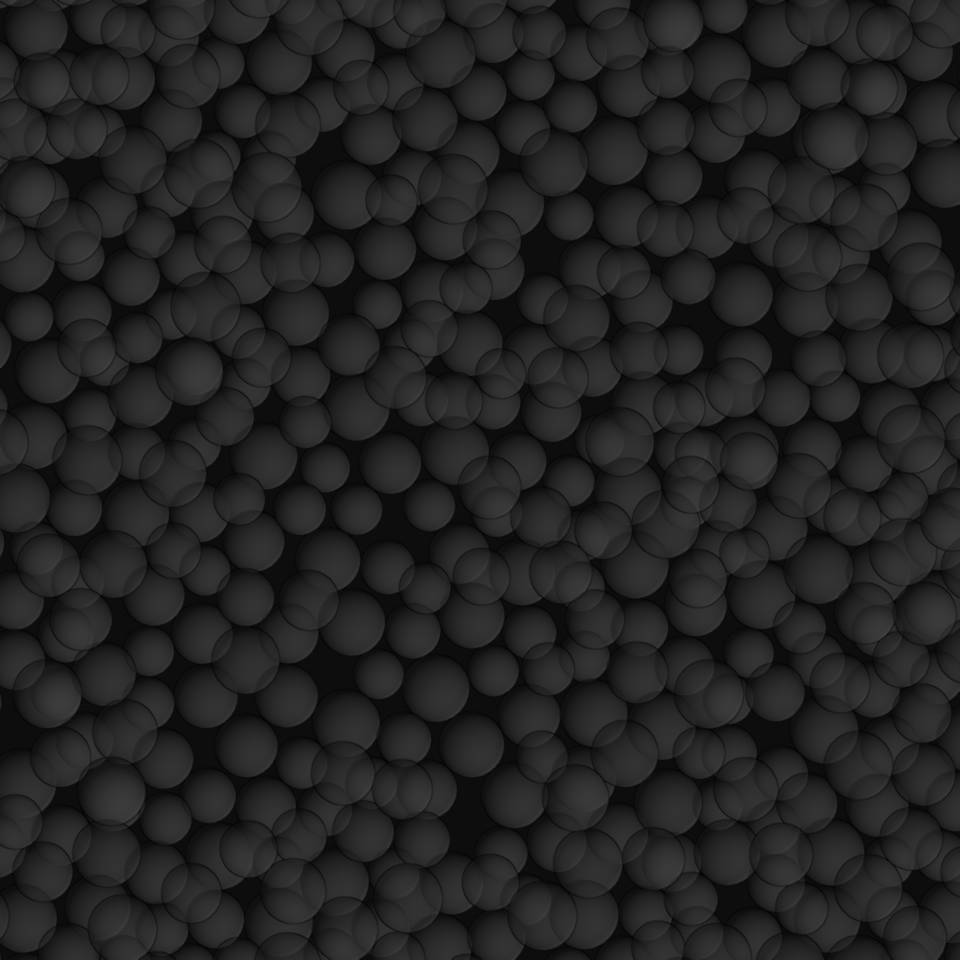

SEM: More Rendering Modes & Production Scale Use
================================================

This tutorial demonstrates a real use-case: the generation of data for the training of a neural network for particle detection in secondary electron microscopy (SEM) images. To train the network, we need a lot of lifelike and `heterogeneous` data, so that the network is applicable to real images and learns to generalize.

Therefore, we create a recipe with a lot of feature variabilities, so that we can introduce some randomness in the generated images. While we're at it, we demonstrate a few more rendering modes, to have some more versatile forms of ground truth available for our training.

Since this is an advanced tutorial, we assume that you are already familiar with the basic concepts of the toolbox.

At a Glance
-----------

.. image:: ../_static/tuts/spheres_sem/real.png
    :width: 32 %

.. image:: ../_static/tuts/spheres_sem/categorical.png
    :width: 32 %

.. image:: ../_static/tuts/spheres_sem/depth_map.png
    :width: 32 %

What You Will Learn
-------------------

* Recap of basic rendering modes: ``real`` and ``categorical``
* More exotic rendering modes: ``stylized``, ``stylized_xray``, ``normal_map`` and ``depth_map``
* How to create a recipe that is versatile enough to create a large and heterogeneous data set, suitable for the training of a particle detection network.

Recipe
------

The recipe for this tutorial can be found in `recipes/spheres_sem.yaml`:

.. code-block:: yaml
  :caption: recipes/spheres_sem.yaml

  defaults:
    - BaseRecipe
    - _self_

  initial_runtime_state:
    time: 0.0
    seed: 42
  blueprints:
    measurement_techniques:
      SEM:
        measurement_technique_prototype_name: secondary_electron_microscope
        background_material_prototype_name: sem_patchy_silicone
    particles:
      Bead:
        geometry_prototype_name: sphere
        material_prototype_name: sem_polystyrene
        parent: MeasurementVolume
        number: 600
  process_conditions:
    feature_variabilities:
      ParticleDimension:
        feature_name: dimensions
        variability:
          _target_: $builtins.UniformDistribution3dHomogeneous
          location: 5
          scale: 2
      ParticleSubdivisions:
        feature_name: subdivisions
        variability:
          _target_: $builtins.Constant
          value: 1
      InitialParticleLocation:
        feature_name: location
        variability:
          _target_: $builtins.UniformlyRandomLocationInMeasurementVolume
      NoiseThreshold:
        feature_name: noise_threshold
        variability:
          _target_: $builtins.UniformDistributionNdHomogeneous
          location: 0.05
          scale: 0.05
          num_dimensions: 1
      Defocus:
        feature_name: defocus
        variability:
          _target_: $builtins.UniformDistributionNdHomogeneous
          location: 0.2
          scale: 0.3
          num_dimensions: 1
      IlluminationStrength:
        feature_name: illumination_strength
        variability:
          _target_: $builtins.UniformDistributionNdHomogeneous
          location: 1
          scale: 2
          num_dimensions: 1
      BackgroundPatchScale:
        feature_name: patch_scale
        variability:
          _target_: $builtins.UniformDistributionNdHomogeneous
          location: 25
          scale: 75
          num_dimensions: 1
      BackgroundPatchSeed:
        feature_name: patch_seed
        variability:
          _target_: $builtins.Constant
          value: ${initial_runtime_state.seed}
  synth_chain:
    feature_generation_steps:
      - _target_: $builtins.InvokeBlueprints
        affected_set_name: AllMeasurementTechniqueBlueprints
      - _target_: $builtins.InvokeBlueprints
        affected_set_name: AllParticleBlueprints
      - _target_: $builtins.TriggerFeatureUpdate
        feature_variability_name: ParticleDimension
        affected_set_name: AllParticles
      - _target_: $builtins.TriggerFeatureUpdate
        feature_variability_name: ParticleSubdivisions
        affected_set_name: AllParticles
      - _target_: $builtins.TriggerFeatureUpdate
        feature_variability_name: InitialParticleLocation
        affected_set_name: AllParticles
      - _target_: $builtins.RelaxCollisions
        affected_set_name: AllParticles
        collision_shape: SPHERE
        use_gravity: True
        gravity:
          - 0
          - 0
          - -100
        num_frames: 250
      - _target_: $builtins.TriggerFeatureUpdate
        feature_variability_name: Defocus
        affected_set_name: AllMeasurementTechniques
      - _target_: $builtins.TriggerFeatureUpdate
        feature_variability_name: NoiseThreshold
        affected_set_name: AllMeasurementTechniques
      - _target_: $builtins.TriggerFeatureUpdate
        feature_variability_name: IlluminationStrength
        affected_set_name: AllMeasurementTechniques
      - _target_: $builtins.TriggerFeatureUpdate
        feature_variability_name: BackgroundPatchScale
        affected_set_name: AllMeasurementTechniques
      - _target_: $builtins.TriggerFeatureUpdate
        feature_variability_name: BackgroundPatchSeed
        affected_set_name: AllMeasurementTechniques
    rendering_steps:
      - _target_: $builtins.SaveState
        name: state
      - _target_: $builtins.RenderParticlesTogether
        rendering_mode: real
      - _target_: $builtins.RenderParticlesTogether
        rendering_mode: categorical
      - _target_: $builtins.RenderParticlesTogether
        rendering_mode: depth_map
      - _target_: $builtins.RenderParticlesTogether
        rendering_mode: normal_map
      - _target_: $builtins.RenderParticlesTogether
        rendering_mode: stylized
      - _target_: $builtins.RenderParticlesTogether
        rendering_mode: stylized_xray

Step 1: Simulating Scanning Electron Microscopy (SEM)
-----------------------------------------------------

To achieve the style of SEM images, we not only have to specify a suitable measurement technique prototype, but we need suitable material prototypes as well:

.. code-block:: yaml
  :emphasize-lines: 5, 6, 10

  ...
  blueprints:
    measurement_techniques:
      SEM:
        measurement_technique_prototype_name: secondary_electron_microscope
        background_material_prototype_name: sem_patchy_silicone
    particles:
      Bead:
        geometry_prototype_name: sphere
        material_prototype_name: sem_polystyrene
        parent: MeasurementVolume
        number: 600

.. note::
  Blender was not made to simulate electrons. This means that we have to fake the SEM style using `subsurface scattering <https://docs.blender.org/manual/en/latest/render/shader_nodes/shader/sss.html>`_.

Step 2: Feature Variabilities
-----------------------------

As mentioned before, this recipe makes extensive use of feature variabilities. For the sake of brevity, we will go over them just briefly.

.. code-block:: yaml

  ...
    ParticleDimension:
      feature_name: dimensions
      variability:
        _target_: $builtins.UniformDistribution3dHomogeneous
        location: 5
        scale: 2
  ...

Although unrealistic for real particle systems, we scale our particles according to a uniform distribution, as not to create a bias towards a certain particle size.

.. code-block:: yaml

  ...
    ParticleSubdivisions:
        feature_name: subdivisions
        variability:
          _target_: $builtins.Constant
          value: 1
  ...

The used geometry prototype has quite a high resolution. Since we're only dealing with spheres (and
actually lots of them), we can reduce the `number of subdivisions <https://docs.blender.org/manual/en/latest/modeling/modifiers/generate/subdivision_surface.html>`_, to speed up the upcoming physics simulation and the rendering.

.. code-block:: yaml

  ...
    InitialParticleLocation:
      feature_name: location
      variability:
        _target_: $builtins.UniformlyRandomLocationInMeasurementVolume
  ...

Although later on, we will use a small physics simulation, to place our particles, we initialize their position, by distributing them evenly in the measurement volume.

.. code-block:: yaml

  ...
    NoiseThreshold:
      feature_name: noise_threshold
      variability:
        _target_: $builtins.UniformDistributionNdHomogeneous
        location: 0.05
        scale: 0.05
        num_dimensions: 1
  ...

This feature variability randomizes the `noise threshold <https://docs.blender.org/manual/en/latest/render/cycles/render_settings/sampling.html#adaptive-sampling>`_ of Blender's Cycles rendering engine through our measurement technique. Here, it is used to control the noise of the resulting images, to match the noisiness of real SEM images.

.. code-block:: yaml

  ...
    Defocus:
      feature_name: defocus
      variability:
        _target_: $builtins.UniformDistributionNdHomogeneous
        location: 0.2
        scale: 0.3
        num_dimensions: 1
  ...

To vary the amount of blur, which can occur in SEM images, we add variation to the ``defocus`` feature of our measurement technique, which controls the depth of field of a camera in Blender.

.. code-block:: yaml

  ...
    IlluminationStrength:
      feature_name: illumination_strength
      variability:
        _target_: $builtins.UniformDistributionNdHomogeneous
        location: 1
        scale: 2
        num_dimensions: 1
  ...

Since the brightness of SEM images is very dependent on the operator, we introduce some variation. The varied feature controls a light source in our measurement technique.

.. code-block:: yaml

  ...
    BackgroundPatchScale:
      feature_name: patch_scale
      variability:
        _target_: $builtins.UniformDistributionNdHomogeneous
        location: 25
        scale: 75
        num_dimensions: 1
  ...

The utilized measurement technique allows us to enable a background plane, which acts as substrate for our particles. The ``sem_patchy_silicone`` material prototype that we assigned is a procedural material and features a lot of small patches. Here, we introduce some variation to the scale of these patches.

.. code-block:: yaml

  ...
    BackgroundPatchSeed:
      feature_name: patch_seed
      variability:
        _target_: $builtins.Constant
        value: ${initial_runtime_state.seed}
  ...

To avoid that our substrate is too similar for images with similar ``patch_scale`` values, we tie the random seed of the substrate material to our global random seed.

Step 3: Feature Generation Steps
--------------------------------

Most feature generation steps of the recipe should already be familiar from other tutorials, so we will not elaborate upon them here, with exception of the ``RelaxCollisions`` step, since we will reference it in Step 5 of this tutorial.

.. code-block:: yaml
  :emphasize-lines: 12

  ...
  synth_chain:
    feature_generation_steps:
      ...
      - _target_: $builtins.RelaxCollisions
        affected_set_name: AllParticles
        collision_shape: SPHERE
        use_gravity: True
        gravity:
          - 0
          - 0
          - -100
        num_frames: 250
      ...
  ...

The noteworthy parameter here is the third element of the ``gravity`` parameter (-100). We will use it to create a more loose or more dense packing of our particle heap. Since the gravity of this feature generation step is not accessible as a feature, we cannot apply a feature variability. However, we can override the value for different executions of the recipe as part of a multirun (see step 5).

Step 4: Rendering Steps
-----------------------

.. code-block:: yaml

  ...
      - _target_: $builtins.SaveState
        name: state
  ...

Saves the scene as a Blender file. The ultimate ground truth.

.. code-block:: yaml

  ...
      - _target_: $builtins.RenderParticlesTogether
        rendering_mode: real
  ...

Renders a lifelike SEM image.

.. figure:: ../_static/tuts/spheres_sem/real.png
  :figwidth: 70 %
  :alt: The "real" image.

.. code-block:: yaml

  ...
      - _target_: $builtins.RenderParticlesTogether
        rendering_mode: categorical
  ...

Renders a categorical image, where pixels of a certain color represent a particle.

.. figure:: ../_static/tuts/spheres_sem/categorical.png
  :figwidth: 70 %
  :alt: 2D ground truth.

.. code-block:: yaml

  ...
      - _target_: $builtins.RenderParticlesTogether
        rendering_mode: depth_map
  ...

Renders a depth map, where each pixel is color-coded based on the relative distance of the underlying geometry to the camera. Darker pixels are closer to the camera than lighter pixels. Despite being 2D, this representation holds some 3D information.

.. figure:: ../_static/tuts/spheres_sem/depth_map.png
  :figwidth: 70 %
  :alt: Depth map.

.. code-block:: yaml

  ...
      - _target_: $builtins.RenderParticlesTogether
        rendering_mode: normal_map
  ...

Renders a normal map, where each pixel is color-coded based on the normal vector of the underlying geometry. Each color channel represents a spatial dimension. Despite being 2D, this representation holds some 3D information.

.. code-block:: yaml

  ...
      - _target_: $builtins.RenderParticlesTogether
        rendering_mode: stylized
  ...

This render mode uses a generic material and lighting. Therefore, it is very universal but abstract.

.. code-block:: yaml

  ...
      - _target_: $builtins.RenderParticlesTogether
        rendering_mode: stylized_xray
  ...

The same as the ``stylized`` rendering mode, but with transparency.

Step 5: Multirun: Producing a Lot of Data
-----------------------------------------

Now that we completed our recipe, we can use it to create a lifelike image and the associated ground truth representations. However, to train a neural network, we need a whole stack of training samples. Since we don't want to write many recipes, we will leverage the power of the ``--multirun`` command-line parameter. Since want to be able to look up the overrides that we are using in a few months from now, we create a small bash script (see ``recipes/secondary_electron_microscopy_multirun.sh``):

.. code-block:: shell
  :caption: recipes/secondary_electron_microscopy_multirun.sh

  #!/usr/bin/env bash

  temp=$( realpath "$0"  )
  script_directory=$( dirname "$temp" )

  cd $script_directory/..

  python run.py \
      --config-dir=recipes \
      --config-name=secondary_electron_microscopy \
      --multirun \
      blueprints.particles.Bead.number=100,200,300,400,500,600 \
      initial_runtime_state.seed=range\(15\) \
      synth_chain.feature_generation_steps.5.gravity.2=-100,-10000

The script consists of two parts. First, it changes into the base directory of the toolbox (independently from the directory it was called from). Secondly, it executes a multirun with three overrides:

* ``blueprints.particles.Bead.number=100,200,300,400,500,600``: Here we vary the number of particles, by iterating a list of six values, so that we yield images with more or less coverage.
* ``initial_runtime_state.seed=range\(15\)``: Here we vary the random seed in the range from 0 to 14, to get different values for the feature variabilities that we defined in Step 2 of this tutorial. Note the use of ``\`` to escape the parentheses.
* ``synth_chain.feature_generation_steps.5.gravity.2=-100,-10000``: Here we vary the `third` element (`z` coordinate) of the ``gravity`` parameter of the `sixth` feature generation step (``RelaxCollisions``, see Step 3 of this tutorial).

Since a multirun executes all permutations of the overrides, we can calculate the number of resulting runs:
``(6 possible numbers of particles) x (15 possible random seeds) x (2 possible gravities) = 180 runs``

To get a feeling for the heterogeneity of the resulting data, let us examine a few examples:

.. image:: ../_static/tuts/spheres_sem/examples/2.png
    :width: 32 %
.. image:: ../_static/tuts/spheres_sem/examples/3.png
    :width: 32 %

.. note::
  We execute the shell script inside our Docker container that is running Linux, so it will work on any host operating system.
