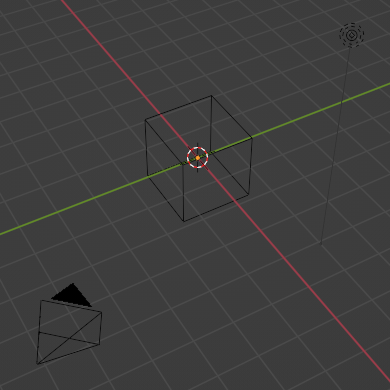
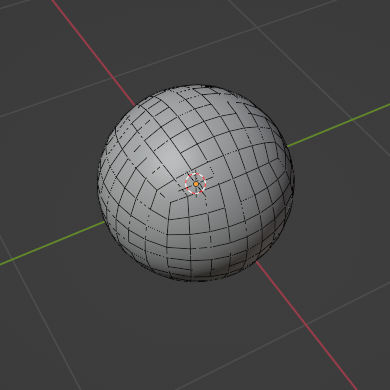
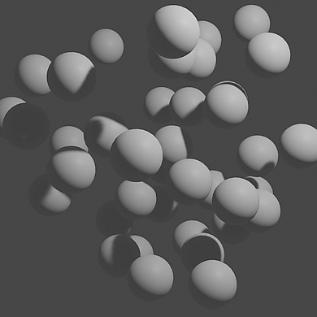
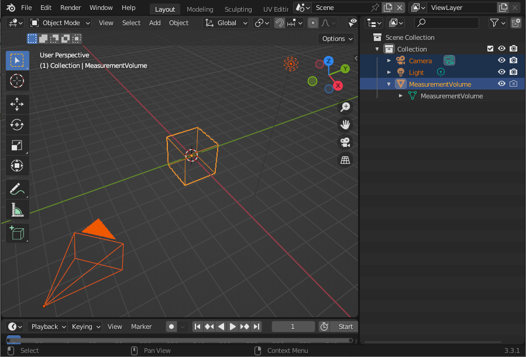
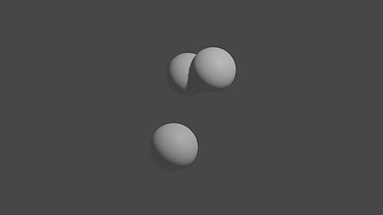
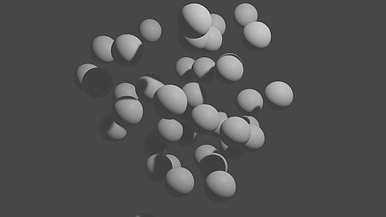

.. _sec-tut_bs_beads:

Synthesized Beads
=================

In this first tutorial, we will have a look at the general concept of synthesizing particle ensembles with ``synthPIC2``. As opposed to the minimum working example "Hello World" of the :ref:`sec-getstart` section, you will learn to know the process of working with a ``SynthRecipe``. The overall structure of such recipe with its main parts is roughly presented. The main goal of this brief tutorial is to get a first impression of working with ``synthPIC2`` to produce synthesized particle data. A more in-depth description of the structure of a ``SynthRecipe`` is given in the :ref:`sec-concept` section.

At a Glance
-----------

What We Will Learn
------------------

* The structure and creation of an executable recipe
* Understanding the content of a measurement technique prototype (=scene setup)
* Invoking blueprints, namely the measurement technique and particles
* Adapting parameters to manipulate the outcome
* Rendering our scene to visualize & quantify results

Step 1: Create and Execute Recipe
---------------------------------

The first thing we need, is our ``SynthRecipe`` for ``synthPIC2``, so our toolbox knows what actually needs to be done. Therefore, we create such a recipe called ``beads.yaml`` inside the ``recipes`` subfolder under our root folder of ``synthPIC2``. Inside this file paste the following content.

.. code-block:: yaml
    :caption: beads.yaml

    # Initializing and seeding
    defaults:
      - BaseRecipe
      - _self_
    initial_runtime_state:
      seed: 42
    # Defining blueprints
    blueprints:
      measurement_techniques:
        Camera:
          measurement_technique_prototype_name: default
    # Procedural steps of synthetization chain
    synth_chain:
      feature_generation_steps:
        - _target_: $builtins.InvokeBlueprints
          affected_set_name: AllMeasurementTechniqueBlueprints
      rendering_steps:
        - _target_: $builtins.RenderParticlesTogether
          rendering_mode: real

What we did with this short snippet is giving ``synthPIC2`` the minimum viable recipe to setup a scene and render it. We can call it by executing the following command inside our Docker container.

.. code-block:: python

    python run.py --config-dir=recipes --config-name=beads

Step 2: Inspect and Understand Scene
------------------------------------

The resulting rendered scene can be found in the image file ``output/beads/<YYYY-MM-DD_hh-mm-ss>/run0/real/<hash>.png`` under our root directory of ``synthPIC2``.

Fascinating, isn't it? We got an empty image!

What did we actually do? Let's have a closer look at our recipe ``beads.yaml``. After the first 6 lines of referencing the BaseRecipe and giving a freely selectable ``seed`` for reproducibility, we build the two major blocks of the recipe: ``blueprints`` and ``synth_chain``. Inside the ``blueprints``, we define one measurement technique, which we call ``Camera``. The following attribute ``measurement_technique_prototype_name`` refers to the ``default.blend`` file, which can be found inside ``prototype_library/measurement_techniques`` and which contains our scene setup for the measurement technique. When we open this file in ``Blender``, we understand how the scene is built.

There is one light source called ``Light``, one camera object called ``Camera`` and one cube in the coordinate origin called ``MeasurementVolume``, which is invisible in rendering (see crossed out camera symbol, right hand side). Going back to our recipe, we see that our ``synth_chain`` defines to first execute a step for feature generation and afterwards a rendering step: First, we invoke the previously defined measurement technique blueprint by simply invoking all defined measurement techniques (we only have one) with the reference to the set ``AllMeasurementTechniqueBlueprints``. Finally, we just capture the scene as seen by the ``Camera`` object in ``Blender``: a photo of the coordinate origin, where the invisible ``MeasurementVolume`` cube sits.

Step 3: Bring in Particles
--------------------------

To make the scene more exciting, let's bring in some particles! We do so, by adding another blueprint called ``Sphere``. We refer to the ``default`` geometry prototype (which is a sphere) and want to have a count of 3 particles in total.

.. code-block:: yaml
    :emphasize-lines: 3-6

    blueprints:
      measurement_techniques: …
      particles:
        Sphere:
          geometry_prototype_name: default
          number: 3

Furthermore, we state a process condition to define the allowed locations for particle placement. ``process_conditions`` can be seen as the physical boundary conditions of the system and are defined one the top-most level in the recipe, in between ``blueprints`` and ``synth_chain``. In our case, we want the particles to be placed inside the ``MeasurementVolume`` and therefore we restrict the particles' feature ``location`` to the boundaries of the ``MeasurementVolume``. Since we want every location to have the same probability, we choose a uniform distribution to draw a random number from.

.. code-block:: yaml

    # Physical boundary conditions
    process_conditions:
      feature_variabilities:
        ParticleLocation:
          feature_name: location
          variability:
            _target_: $builtins.UniformlyRandomLocationInMeasurementVolume

Finally, we want to use our newly defined elements and therefore need to add two more steps to our ``synth_chain`` under ``feature_generation_steps``.

.. code-block:: yaml
    :emphasize-lines: 3-7

    synth_chain:
      feature_generation_steps:
        - _target_: $builtins.InvokeBlueprints
          affected_set_name: AllParticleBlueprints
        - _target_: $builtins.TriggerFeatureUpdate
          feature_variability_name: ParticleLocation
          affected_set_name: AllParticles

The first new step invokes the three particles, which means to import the geometry as often as specified (here: three times) with original coordinates from their ``.blend`` file, the origin by default. Only afterwards, the particles are actually repositioned by easily triggering the update of the earlier defined feature: ``ParticleLocation``. Note that we do not have to specify exactly, how the feature should behave. We just "trigger" the update. The reason for this is that we already defined the physical boundary condition inside ``process_conditions``. Our extended ``beads.yaml`` recipe should now look as follows.

.. code-block:: yaml
    :caption: beads.yaml
    :emphasize-lines: 12-22,28-32

    # Initializing and seeding
    defaults:
      - BaseRecipe
      - _self_
    initial_runtime_state:
      seed: 42
    # Defining blueprints
    blueprints:
      measurement_techniques:
        Camera:
          measurement_technique_prototype_name: default
      particles:
        Sphere:
          geometry_prototype_name: default
          number: 3
    # Physical boundary conditions
    process_conditions:
      feature_variabilities:
        ParticleLocation:
          feature_name: location
          variability:
            _target_: $builtins.UniformlyRandomLocationInMeasurementVolume
    # Procedural steps of synthetization chain
    synth_chain:
      feature_generation_steps:
        - _target_: $builtins.InvokeBlueprints
          affected_set_name: AllMeasurementTechniqueBlueprints
        - _target_: $builtins.InvokeBlueprints
          affected_set_name: AllParticleBlueprints
        - _target_: $builtins.TriggerFeatureUpdate
          feature_variability_name: ParticleLocation
          affected_set_name: AllParticles
      rendering_steps:
        - _target_: $builtins.RenderParticlesTogether
          rendering_mode: real

Executing the updated ``SynthRecipe`` produces the rendered image of our three particles.

Step 4: Pumping up the Scene
----------------------------

Okay, that was a good start! As a next step, we add some more particles by simply increasing the number when defining the particle blueprint ``Sphere``.

.. code-block:: yaml
    :emphasize-lines: 6

    blueprints:
      measurement_techniques: …
      particles:
        Sphere:
          geometry_prototype_name: default
          number: 40

We add a new feature variability to scale the particles. They should only measure 60% of the diameter of their initial standard unit size as taken from the geometry prototype ``default.blend`` file. Another feature generation step will execute the procedural step of the ``synth_chain`` to apply the resizing, i.e. triggering the update of the feature ``dimensions`` within its allowed feature variability ``ParticleDimension``.

.. code-block:: yaml
    :emphasize-lines: 3-8,11-13

    process_conditions:
      feature_variabilities:
        ParticleDimension:
          feature_name: dimensions
          variability:
            _target_: $builtins.UniformDistribution3dHomogeneous
            location: 0.6
            scale: 0
    synth_chain:
      feature_generation_steps:
        - _target_: $builtins.TriggerFeatureUpdate
          feature_variability_name: ParticleDimension
          affected_set_name: AllParticles

We add one more feature generation step ``RelaxCollisions`` to avoid particle intersection after the random positioning inside the ``MeasurementVolume``. Additionally, we add the attribute ``do_save_features`` to the rendering step to obtain quantitative data of our synthesized beads. The final ``SynthRecipe`` looks as follows.

.. code-block:: yaml
    :caption: beads.yaml
    :emphasize-lines: 15,23-28,39-44,48

    # Initializing and seeding
    defaults:
      - BaseRecipe
      - _self_
    initial_runtime_state:
      seed: 42
    # Defining blueprints
    blueprints:
      measurement_techniques:
        Camera:
          measurement_technique_prototype_name: default
      particles:
        Sphere:
          geometry_prototype_name: default
          number: 40
    # Physical boundary conditions
    process_conditions:
      feature_variabilities:
        ParticleLocation:
          feature_name: location
          variability:
            _target_: $builtins.UniformlyRandomLocationInMeasurementVolume
        ParticleDimension:
          feature_name: dimensions
          variability:
            _target_: $builtins.UniformDistribution3dHomogeneous
            location: 0.6
            scale: 0
    # Procedural steps of synthetization chain
    synth_chain:
      feature_generation_steps:
        - _target_: $builtins.InvokeBlueprints
          affected_set_name: AllMeasurementTechniqueBlueprints
        - _target_: $builtins.InvokeBlueprints
          affected_set_name: AllParticleBlueprints
        - _target_: $builtins.TriggerFeatureUpdate
          feature_variability_name: ParticleLocation
          affected_set_name: AllParticles
        - _target_: $builtins.TriggerFeatureUpdate
          feature_variability_name: ParticleDimension
          affected_set_name: AllParticles
        - _target_: $builtins.RelaxCollisions
          affected_set_name: AllParticles
          collision_shape: SPHERE
      rendering_steps:
        - _target_: $builtins.RenderParticlesTogether
          rendering_mode: real
          do_save_features: True

We execute the recipe one more time.

.. code-block:: python

    python run.py --config-dir=recipes --config-name=beads

Now, we can open our resulting file ``output/beads/<YYYY-MM-DD_hh-mm-ss>/run0/real/<hash>.png`` and look at a nice illustration of our first rendered particle ensemble.

The accompanying file ``particle_features.csv`` in the same folder gives insights about the particles' individual ID (hash), the name of the blueprint from which they were invoked, their dimension and exact position as well as further features of each particle.
