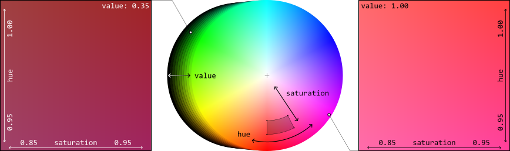
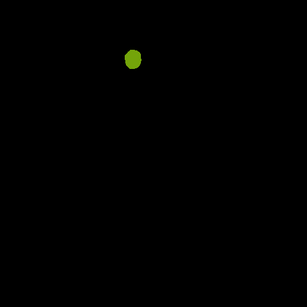

Pearls & Plasticine on Plane
============================

Now we will bring a little variance into the shape of our particles. Furthermore, we do not just vary the shape of our one particle kind, but also introduce a second particle type, which distinguishes in shape and color from the first type. The whole scene's complexity is increased by various feature manipulations.

At a Glance
-----------

.. image:: ../_static/tuts/plasticine_plane/AAG_1.png
    :width: 24.5 %
.. image:: ../_static/tuts/plasticine_plane/AAG_2.png
    :width: 24.5 %
.. image:: ../_static/tuts/plasticine_plane/AAG_3.png
    :width: 24.5 %

What We Will Learn
------------------

* Inheritance of recipes
* Several particle blueprints with complex geometries
* Assign more realistic materials
* Separately adapt attributes via specified sets
* Add turbidity to the scene
* Learn new render mode ``categorical``

Step 1: Value the Past: Inheritance
-----------------------------------

As usual, we start by creating a new recipe file -- call it ``plasticine_plane.yaml`` this time -- and add our first block to initialize and seed the recipe. However, instead of starting all over every time when creating a new recipe, this time we'll make use of another recipe and build upon that. In fact, we take the last one, which we created in the previous tutorial: ``colPearls_plane.yaml``. In order to reference that and build upon it, we easily need to add it to our list of defaults. 

.. code-block:: yaml
    :caption: plasticine_plane.yaml
    :emphasize-lines: 4

    # Initializing and seeding
    defaults:
      - BaseRecipe
      - colPearls_plane
      - _self_

What we just did, is defining a list of single recipes, where every subsequent recipe builds upon the previous one and adds the content from itself. When specific definitions already existed before, it overwrites that content. In our case, we build upon the ``BaseRecipe`` and afterwards add the content of the recipe, which is defined in the file ``colPearls_plane.yaml`` (the toolbox ``synthPIC2`` knows that the recipes are located under ``recipes/..`` and we do not need to name the file extension). In the end, we add the content of the current recipe itself by putting the entry ``_self_`` into the list. The current recipe is quite empty at the moment (nothing else than ``defaults``), so actually, we only specified to execute the repice ``colPearls_plane`` at the moment. When we currently run our new recipe, we get the same result as if we would run ``colPearls_plane`` from the last tutorial.

.. code-block:: python

    python run.py --config-dir=recipes --config-name=plasticine_plane

.. image:: ../_static/tuts/plasticine_plane/firstRenderPrevRecipe.png
    :alt: Final rendering of previous tutorial

You're advised to decrease the render samples to a low value like ``64`` or ``128`` in this tutorial, if you want to save some time or are bound to hardware limitations. However, we will present those versions of images rendered with ``2048`` samples throughout the tutorial.

.. code-block:: yaml
    :caption: plasticine_plane.yaml

    # Physical boundary conditions
    process_conditions:
      feature_variabilities:
        CyclesSamples:
          variability:
            value: 64 # small during tutorial, high for final render

As can be seen, we really only needed to add the one value, which we wanted to change, here ``value: 64`` (of course in the namespace tree containing it ``process_conditions`` :math:`\curvearrowright` ``feature_variabilities`` :math:`\curvearrowright` ``CyclesSamples`` :math:`\curvearrowright` ``variability``). That means, this time we didn't need to specify ``feature_name: cycles_samples`` under ``CyclesSamples:`` and we didn't need to specify ``_target_: $builtins.Constant`` under ``variability:`` again, since those are both already defined in the recipe ``colPearls_plane`` from which we inherit and therefore build upon.

One last thing we actually want to change before concluding the first step in this tutorial, is to bring in a new shape: a new ``geometry prototype`` for the particles. Therefore, let's just change this one attribute in its corresponding namespace by adding four lines of code: three for the namespace and one for the attribute ``geometry_prototype_name``, which we want to change.

.. code-block:: yaml
    :caption: plasticine_plane.yaml
    :emphasize-lines: 6-10

    # Initializing and seeding
    defaults:
      - BaseRecipe
      - colPearls_plane
      - _self_
    # Defining blueprints
    blueprints:
      particles:
        Bead:
          geometry_prototype_name: potato
    # Physical boundary conditions
    process_conditions:
      feature_variabilities:
        CyclesSamples:
          variability:
            value: 2048 # small during tutorial, high for final render

In this first step, we saw how easy it is to create a new recipe based on prior work using the inheritance mechanism of recipes.

Step 2: Playing With Plasticine
-------------------------------

Now we introduce a second shape and again want to end up with 40 particles in total.

.. code-block:: yaml
    :caption: plasticine_plane.yaml
    :emphasize-lines: 5-9

    blueprints:
      particles:
        Bead:
          geometry_prototype_name: potato
          number: 15
        Worm:
          geometry_prototype_name: worm_twisted
          parent: MeasurementVolume
          number: 25

This new shape, which we added, has a worm-like, twisted appearance -- something you could achieve by playing with plasticine. We'll have a look at the possibilities of how to play around with it in a moment. Let's first visualize our result.

.. image:: ../_static/tuts/plasticine_plane/regularPearlsWorms.png
    :alt: Regular pearls and worms

To get an idea what we can do with those plasticine worms, let's have a look at their geometry prototype: We can find it under ``prototype_library/geometries/..`` in the two files ``worm_twisted.blend`` and ``worm_twisted.yaml``. The first describes the geometry in a ``.blend`` file, while the second `accompanying file` specifies the features which are allowed to be changed. Let's first have a look in the latter.

.. code-block:: yaml
    :caption: worm_twisted.yaml
    :emphasize-lines: 5,7,9

    features:
      - name: dimensions …
      - name: location …
      - name: location_z …
      - name: rotations
        blender_link: bpy.data.objects["GeometryPrototype"].modifiers["GeometryNodes"]["Input_2"]
      - name: thickness
        blender_link: bpy.data.objects["GeometryPrototype"].modifiers["GeometryNodes"]["Input_3"]
      - name: resolution
        blender_link: bpy.data.objects['GeometryPrototype'].modifiers["Remesh"].voxel_size

Next to the first three features ``dimensions``, ``location`` and ``location_z`` (which can also be found, e.g. in the ``geometry prototype`` of the ``sphere``), we have three further features for the shape definition of our worms. They are called ``rotations``, ``thickness`` and ``resolution``. For the moment, the statements after ``blender_link:`` after each feature name can be ignored. For a better -- visual -- understanding of what we actually change, let's open the geometry ``.blend`` file in ``Blender``.

.. image:: ../_static/tuts/plasticine_plane/wormShapes.png
    :alt: Different worm shapes by feature manipulation 

When we now want to adjust those features in our recipe, we define the ``feature_variabilities`` and call the ``TriggerFeatureUpdate`` as usual. Actually, we do not `adjust` them directly, but rather define a range, in which those features are allowed to be set during randomization while ``TriggerFeatureUpdate``. So, let's first define our ``feature_variabilities`` under ``process_conditions``. Keep in mind, that we're still inheriting from the other recipe ``colPearls_plane`` and therefore, just need to add/overwrite our desired new elements. However, changing the ``feature_generation_steps`` works a little bit different, as we will see soon.

Let's add the new ``feature_variabilities``, which we call ``WormRotations``, ``WormThickness`` and ``WormResolution``, to vary our features (as named in the prototype accompanying file) ``rotations``, ``thickness`` and ``resolution``, respectively.

.. code-block:: yaml
    :caption: plasticine_plane.yaml
    :emphasize-lines: 3-19

    process_conditions:
      feature_variabilities:
        WormRotations:
          feature_name: rotations
          variability:
            _target_: $builtins.UniformDistributionNdHomogeneous
            location: 0.4
            scale: 0.8
        WormThickness:
          feature_name: thickness
          variability:
            _target_: $builtins.UniformDistributionNdHomogeneous
            location: 0.035
            scale: 0.01
        WormResolution:
          feature_name: resolution
          variability:
            _target_: $builtins.Constant
            value: 0.15
        CyclesSamples:
          variability:
            value: 2048 # small during tutorial, high for final render

Via the ``feature variability`` named ``WormResolution``, we specified a constant value of ``0.15`` for the feature ``resolution`` of our worms. The other both features were restricted to the allowed intervals as ``rotations``:math:`\in [0.4,1.2)` and ``thickness``:math:`\in [0.035,0.045)` by their corresponding ``feature_variabilities`` named ``WormRotations`` and ``WormThickness``, respectively. Now we only need to add the corresponding calls to trigger the update of those features.

However, while we heavily used the concept of inheritance so far, this `isn't` quite as easy for the ``synth_chain``, as well. The latter contains only two more attributes which we can add/overwrite, namely the ``feature_generation_steps`` and the ``rendering_steps``. When we want to manipulate a specific step below this level, it is `not` possible to granularly change one element solely by a further recipe in the inheritance chain. The reason for that is that we're dealing with lists here: A list can only be replaced in its whole. Therefore, in the current version of ``synthPIC2``, when we want to change one or more elements of the ``feature_generation_steps`` `or` the ``rendering_steps``, we need to redefine the whole list. And that is what we do now:

.. code-block:: yaml
    :caption: plasticine_plane.yaml
    :emphasize-lines: 14-22

    # Procedural steps of synthetization chain
    synth_chain:
      feature_generation_steps:
        - _target_: $builtins.InvokeBlueprints
          affected_set_name: AllMeasurementTechniqueBlueprints
        - _target_: $builtins.InvokeBlueprints
          affected_set_name: AllParticleBlueprints
        - _target_: $builtins.TriggerFeatureUpdate
          feature_variability_name: InitialParticleLocation
          affected_set_name: AllParticles
        - _target_: $builtins.TriggerFeatureUpdate
          feature_variability_name: ParticleDimension
          affected_set_name: AllParticles
        - _target_: $builtins.TriggerFeatureUpdate
          feature_variability_name: WormRotations
          affected_set_name: AllParticles
        - _target_: $builtins.TriggerFeatureUpdate
          feature_variability_name: WormThickness
          affected_set_name: AllParticles
        - _target_: $builtins.TriggerFeatureUpdate
          feature_variability_name: WormResolution
          affected_set_name: AllParticles
        - _target_: $builtins.RelaxCollisions
          affected_set_name: AllParticles
          num_frames: 20
          collision_shape: SPHERE
        - _target_: $builtins.RelaxCollisions
          affected_set_name: AllParticles
          use_gravity: True
          damping: 0.07
          friction: 0.4
          restitution: 0.1
          collision_margin: 0.5
          num_frames: 150
          collision_shape: CONVEX_HULL
        - _target_: $builtins.TriggerFeatureUpdate
          feature_variability_name: BackgroundColor
          affected_set_name: AllMeasurementTechniques
        - _target_: $builtins.TriggerFeatureUpdate
          feature_variability_name: PinkColor
          affected_set_name: AllParticles
        - _target_: $builtins.TriggerFeatureUpdate
          feature_variability_name: RenderingResolutionPercentage
          affected_set_name: AllMeasurementTechniques
        - _target_: $builtins.TriggerFeatureUpdate
          feature_variability_name: CyclesSamples
          affected_set_name: AllMeasurementTechniques

Actually, only the highlighted lines differ from those of the last tutorial, i.e. the recipe that we inherit from. However, as described above we need to add the whole list of ``feature_generation_steps`` to our new recipe.

As a last detail of shape manipulation, we also want to introduce some variation for our ``Beads`` and therefore supply a random value (acting as seed) to the available feature ``shape`` of our ``geometry prototype`` named ``potato``. Let's add the new ``feature variability`` directly add the top of all ``feature_variabilities``.

.. code-block:: yaml
    :caption: plasticine_plane.yaml
    :emphasize-lines: 3-8

    process_conditions:
      feature_variabilities:
        BeadShape:
          feature_name: shape
          variability:
            _target_: $plugins.official.UniformDistributionInt
            location: 0
            scale: 10000
        WormRotations: …

We will add the corresponding ``feature generation step`` to trigger that feature update right in between our ``TriggerFeatureUpdate`` for ``ParticleDimension`` and ``WormRotations``.

.. code-block:: yaml
    :caption: plasticine_plane.yaml
    :emphasize-lines: 9-11

    synth_chain:
      feature_generation_steps:
        - _target_: $builtins.InvokeBlueprints …
        - _target_: $builtins.InvokeBlueprints …
        - _target_: $builtins.TriggerFeatureUpdate …
        - _target_: $builtins.TriggerFeatureUpdate
          feature_variability_name: ParticleDimension
          affected_set_name: AllParticles
        - _target_: $builtins.TriggerFeatureUpdate
          feature_variability_name: BeadShape
          affected_set_name: AllParticles
        - _target_: $builtins.TriggerFeatureUpdate
          feature_variability_name: WormRotations
          affected_set_name: AllParticles

Our rendered image of the scene after adding those variations to shape for our particle types ``Bead`` and ``Worm`` looks as follows.

.. image:: ../_static/tuts/plasticine_plane/AAG_1.png
    :alt: All particles show shape variation now

Step 3: Richness in Material Details
------------------------------------

After we brought in a lot of variation for our particle shapes, i.e. the geometry, we now want to tweak our materials. Two major aspects, which strongly influence the image's final appearance, are `color` and `texture`.

We already have some color in our image, which we inherited from the recipe ``colPearls_plane``. Our particles are pink and the background is beige. Both were defined as a constant, exact color by the HSV color representation. We remember the definitions in our old recipe from the previous tutorial.

.. code-block:: yaml
    :caption: colPearls_plane.yaml
    :emphasize-lines: 7-18

    process_conditions:
      feature_variabilities:
        InitialParticleLocation: …
        ParticleDimension: …
        RenderingResolutionPercentage: …
        CyclesSamples: …
        BackgroundColor:
          feature_name: color
          variability:
            _target_: $plugins.official.ConstantHsvColorAsRgb
            hue: 0.15
            saturation: 0.35
        PinkColor:
          feature_name: color
          variability:
            _target_: $plugins.official.ConstantHsvColorAsRgb
            hue: 0.95
            saturation: 0.85

We now want to introduce some variation. To be more specific, we want to give the `pink` color of our particles a little bit more possibilities of appearance -- we want to allow the color to spread further into the red area of our color wheel. To better understand what this actually means, expressed in numeric HSV values, let's bring up the color wheel one more time.

Based on our old `pink` color with values ``hue: 0.95``, ``saturation: 0.85`` and ``value: 1.00`` (implicitly chosen, since no specification of ``value`` defaults to ``1.0``), we want to extend the range in all these three dimensions. As can be seen in the figure, the two-dimensional range limits of :math:`0.95\dots 1.00` for ``hue`` and :math:`0.85\dots 0.95` for ``saturation`` correspond to a segment of an annulus in the color wheel (see dark area). The ``value``, which is plotted in the third dimension, defines the brightness. Note that the little markers in the figure do not indicate the exact color position, but illustrate the ``value`` parameter of the HSV representation. To get an idea how strongly we increased the range of possible colors, let's search for our previous `pink` color: In the right square -- showing the colors for ``value: 1.00`` -- our previous `pink` color sits in the bottom left corner as a fixed color with an exact value. More variation, we didn't allow by the ``feature variability`` named ``PinkColor`` from the last tutorial.

Now, we add another ``feature variability`` in our new recipe, right below our earlier definitions for the shape features and call it ``ReddishColor``.

.. code-block:: yaml
    :caption: plasticine_plane.yaml
    :emphasize-lines: 6-15

    feature_variabilities:
      BeadShape: …
      WormRotations: …
      WormThickness: …
      WormResolution: …
      ReddishColor:
        feature_name: color
        variability:
          _target_: $plugins.official.RandomHsvColorAsRgb
          h_min: 0.95
          h_max: 1
          s_min: 0.85
          s_max: 0.95
          v_min: 0.35
          v_max: 1
      CyclesSamples: …

Since we do not want to allow this color variety for all of our particles, but only for our plasticine worms, let's again control this distinction by ``sets``. This time however, we cannot easily take standard sets (e.g. ``AllMeasurementTechniques``, ``AllParticles``) as we did last time, when we assigned separate background and particle colors. Hence, we need to create two new ``sets`` to distinguish our both particle kinds.

The content of ``sets``, i.e. which objects belong to them `during runtime`, is defined by logical combination of criteria. Let's think about it: What is our criterion for distinction? The difference between a ``Bead`` and a ``Worm``... They are different particle types, defined by different ``blueprints``! So let's take this criterion: The distinction by their origin and filter for their blueprints' name. We create two new ``feature_criteria`` and two corresponding ``sets`` under our ``process_conditions``. Let's add them before our ``feature_variabilities``.

.. code-block:: yaml
    :caption: plasticine_plane.yaml
    :emphasize-lines: 2-17

    process_conditions:
      feature_criteria:
        IsBead:
          _target_: $builtins.ContainsString
          feature_name: blueprint_name
          search_string: Bead
          default_return_value: False
        IsWorm:
          _target_: $builtins.ContainsString
          feature_name: blueprint_name
          search_string: Worm
          default_return_value: False
      sets: 
        BeadsInView:
          criterion: $IsParticle and $IsBead
        WormsInView:
          criterion: $IsParticle and $IsWorm
      feature_variabilities:
        BeadShape: …
        WormRotations: …
        WormThickness: …
        WormResolution: …
        ReddishColor: …
        CyclesSamples: …

Everything is prepared now to assign the colors (more exactly: the allowed color variabilities) to our desired particles, based on their affiliation to a certain set. This assignment will be evaluated during runtime, i.e. the evaluation which particle belongs to which ``set`` happens when the concrete ``feature_generation_step`` is executed. We add the new ``TriggerFeatureUpdate`` for our ``feature_variability`` with name ``ReddishColor`` right below our other both ``feature_generation_steps``, which trigger the update of the feature ``color`` according to the ``feature_variabilities`` named ``BackgroundColor`` and ``PinkColor``.

.. code-block:: yaml
    :caption: plasticine_plane.yaml
    :emphasize-lines: 6-9

        - _target_: $builtins.TriggerFeatureUpdate
          feature_variability_name: BackgroundColor
          affected_set_name: AllMeasurementTechniques
        - _target_: $builtins.TriggerFeatureUpdate
          feature_variability_name: PinkColor
          affected_set_name: BeadsInView
        - _target_: $builtins.TriggerFeatureUpdate
          feature_variability_name: ReddishColor
          affected_set_name: WormsInView

Note that we also adjusted our already existing ``TriggerFeatureUpdate`` for ``PinkColor`` by changing the ``affected_set_name`` to our newly created set ``BeadsInView``. Executing the recipe at the current state outputs a rendered image with all ``Beads`` still having their fixed pink color, while our plasticine ``Worms`` show a reddish tint. Most importantly, all ``Worms`` have a `different`, unique (randomized) color, which was defined/restricted by the ``feature_variability`` named ``ReddishColor``.

As a last measure to conclude the current step of this tutorial: We'll tune the materials! This can easily be done by adding the following five lines to our ``blueprints`` section.

.. code-block:: yaml
    :caption: plasticine_plane.yaml
    :emphasize-lines: 2-4,8,12

    blueprints:
      measurement_techniques:
        TopCamInAir:
          background_material_prototype_name: cracks_subtle
      particles:
        Bead:
          geometry_prototype_name: potato
          material_prototype_name: colored_subtle
          number: 15
        Worm:
          geometry_prototype_name: worm_twisted
          material_prototype_name: colored_subtle
          parent: MeasurementVolume
          number: 25

We defined the both materials ``cracks_subtle`` and ``colored_subtle`` for our background and for our particles, respectively. As the names suggest, those materials show only a subtle nuance of structure, but add more realism to the scene than the previous ``plain`` materials could do. Those more complex materials make use of procedurally generated textures and show little, but clear difference especially in the specular highlights, see rendered image.

.. image:: ../_static/tuts/plasticine_plane/complexMaterials.png
    :alt: Use of complex materials with procedural textures

Step 4: Clear Vision in Fog
---------------------------

In this last step of our tutorial, we add that little salt and pepper to our scene. Namely, we want to add some turbidity to our vision: a homogeneous fog. When looking at our last rendered images: They all look sharp... very crisp. Nice, but not very realistic. In practice, there's often at least some extent of blur in recorded images of particles by dust or the like (participating media) in the measurement volume. Our ``measurement_technique`` named ``TopCamInAir`` with its ``geometry prototype`` (defined in ``measurement_technique_prototype_name``) named ``plane_topCam_fog`` already contains that property. We just have to turn it on! Let's add another ``feature variability``, which defines the feature ``fog``. We'll name it ``MeasurementVolumeFog``.

.. code-block:: yaml
    :caption: plasticine_plane.yaml
    :emphasize-lines: 7-11

      feature_variabilities:
        BeadShape: …
        WormRotations: …
        WormThickness: …
        WormResolution: …
        ReddishColor: …
        MeasurementVolumeFog:
          feature_name: fog
          variability:
            _target_: $builtins.Constant
            value: 0.025
        CyclesSamples: …

Again, we also need to add the corresponding ``TriggerFeatureUpdate`` as a new ``feature_generation_step``. We add it right in between the ``TriggerFeatureUpdates`` for ``ReddishColor`` and ``RenderingResolutionPercentage``.

.. code-block:: yaml
    :caption: plasticine_plane.yaml
    :emphasize-lines: 4-6

        - _target_: $builtins.TriggerFeatureUpdate
          feature_variability_name: ReddishColor
          affected_set_name: WormsInView
        - _target_: $builtins.TriggerFeatureUpdate
          feature_variability_name: MeasurementVolumeFog
          affected_set_name: AllMeasurementTechniques
        - _target_: $builtins.TriggerFeatureUpdate
          feature_variability_name: RenderingResolutionPercentage
          affected_set_name: AllMeasurementTechniques

The addition of this fog (technically: volume scatter) to our scene will result in a higher render time / higher number of needed samples for an output image with a satisfyingly low amount of noise. Therefore, you should always carefully consider if volume scattering is really needed for the concrete use case.

.. image:: ../_static/tuts/plasticine_plane/AAG_2.png
    :alt: Fog was added to the scene

Up to this point, we put quite a lot of effort into rendering an image that represents the synthesized image in an appearance similar to that taken by a real photo camera. Let's recap our steps to increase the complexity of the scene, for a moment.

First, we added color to the simple material ``plain`` and then introduced color variation in a specific range for one type of our particles. Afterwards, we increased the complexity by choosing new materials, which also contain a feature named ``color``. Therefore we kept our currently chosen color for the particles, but just added a subtle texture with the new material. As a last step, we added a very low amount of volume scatter to simulate a fine fog.

.. image:: ../_static/tuts/plasticine_plane/compareComplexity.png
    :alt: Increased complexity of the scene

High resolution images (click to enlarge):

.. image:: ../_static/tuts/plasticine_plane/hiRes_plainMat.png
    :width: 19.5 %
.. image:: ../_static/tuts/plasticine_plane/hiRes_color.png
    :width: 19.5 %
.. image:: ../_static/tuts/plasticine_plane/hiRes_colVary.png
    :width: 19.5 %
.. image:: ../_static/tuts/plasticine_plane/hiRes_compMat_noFog.png
    :width: 19.5 %
.. image:: ../_static/tuts/plasticine_plane/hiRes_fog0p025.png
    :width: 19.5 %

To conclude this tutorial, we want to have a look at another ``rendering_mode`` called ``categorical``. Let's first start by actually creating a ``rendering_steps`` list and adding our "normal" ``rendering_step`` to output the ``real`` image. Afterwards, we add two new ``rendering_steps`` with ``rendering_mode: categorical``.

.. code-block:: yaml
    :caption: plasticine_plane.yaml

      rendering_steps:
        - _target_: $builtins.RenderParticlesTogether
          rendering_mode: real
          do_save_features: True
        - _target_: $builtins.RenderParticlesTogether
          rendering_mode: categorical
        - _target_: $builtins.RenderParticlesIndividually
          rendering_mode: categorical
          subfolder: individual

The first ``categorical`` step targets the function ``RenderParticlesTogether`` to render all particles on one image. So far, for our recently created images with ``rendering_mode: real``, we used this function all the time. This function causes that areas of rear particles, where front particles overlap those, are occluded. In the second ``categorical`` step, we want to render each particle on one separate image while neglecting the existence of other particles. This will output all pixels of each specific particle, regardless of the existence of other particles, which would actually overlap those areas. However, in our example here, we do not have overlapping particles anyways, so the ``RenderParticlesTogether`` step is the most senseful here.

.. image:: ../_static/tuts/plasticine_plane/AAG_3.png
    :alt: All particles are categorically rendered together

Particles, which are each individually rendered on one image, are placed in the subfolder whose name we specified as ``individual``. Six example images are shown here.

.. image:: ../_static/tuts/plasticine_plane/indivSample2.png
    :width: 32.5 %
.. image:: ../_static/tuts/plasticine_plane/indivSample3.png
    :width: 32.5 %

For this mode ``categorical``, the earlier defined ``CyclesSamples`` are of no importance. We see no details of the photo-realistic appearance, for which we put quite a lot of effort into the creation of our recipe. However, this mode brings something very valuable: We exclusively see the plain and simple exact pixel coordinates, color-coded with their belonging to each particle. The location with exact boundary (i.e. shape) and therefore the two-dimensional size are unambiguously described for each single particle. A very valuable knowledge of the ground truth in our images, e.g. for generation of training data for neural networks.

In the fourth line of the last code snipped we stated ``do_save_features: True``. By this, the additional files ``measurement_technique_features.csv`` and ``particle_features.csv`` are output in the corresponding subfolder of the ``rendering_step``. The latter of the two files contains all features for all particles, including the ``category_color`` of each particle. Therefore, especially when using the ``categorical`` render mode, at least one of the ``rendering_steps`` should also output these files by setting ``do_save_features: True``. So, further data sorting and assignability of each particle with its features to the color-coded location on the ``categorical`` image is made possible.

As you can see, the term "rendering" is used in ``synthPIC2`` in a more general context. While in the context of computer graphics, it often directly means the generation of an image. We rather define it in the context of `translating` features from our virtual reality (3D measurement volume) domain into an explicit format. This can be a numeric table, a photo-realistically rendered image, categorical images or also the full geometrical data of each particle, i.e. the mesh data.